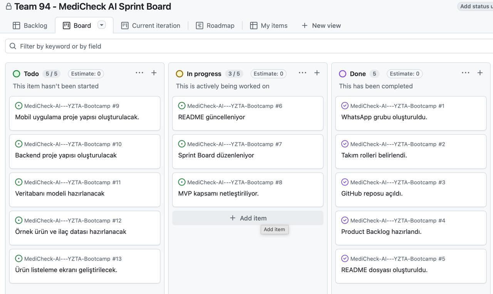
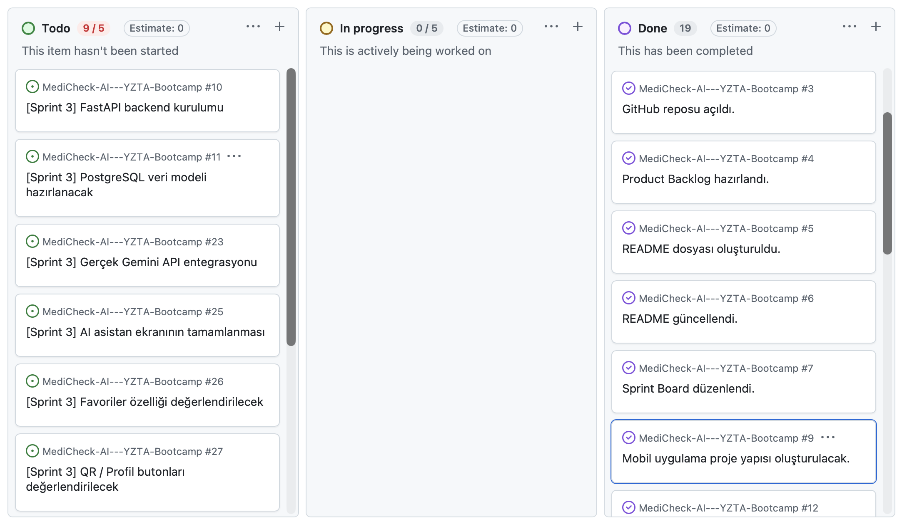
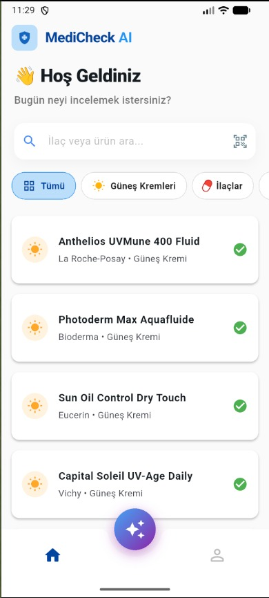
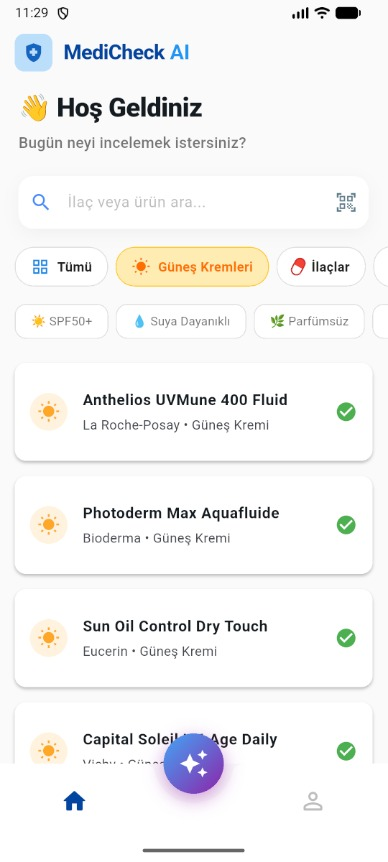
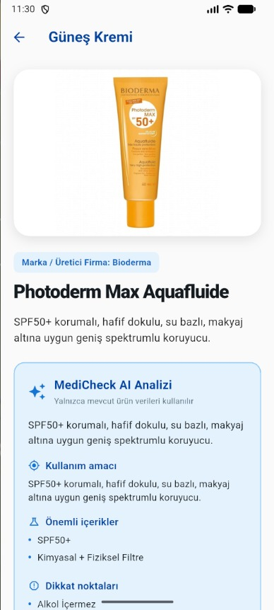
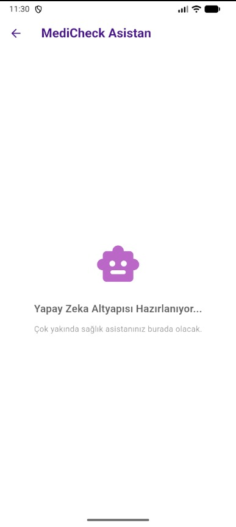

# MediCheck AI

## Takım Bilgileri

**Takım Numarası:** 94

## Takım Rolleri

| İsim | Rol |
|---|---|
| Pelin Yaşar | Scrum Master |
| Irmak Gündüz | Product Owner |
| Seymen Budak | Developer |
| Yusuf Emre Sucu | Developer |

> Not: Takımımız aktif olarak 4 kişiyle iletişim halindedir. Bir ekip üyemize henüz ulaşılamamıştır. Ekip içi iletişim için WhatsApp grubu oluşturulmuştur.

---

## Ürün İsmi

**MediCheck AI**

---

## Ürün Açıklaması

MediCheck AI, kullanıcıların ilaç prospektüslerini ve dermokozmetik ürün içeriklerini daha anlaşılır şekilde inceleyebilmesini sağlayan yapay zeka destekli bir mobil sağlık okuryazarlığı uygulamasıdır.

Uygulama; ilaçların kullanım bilgileri, yan etkileri ve uyarılarını sadeleştirirken, güneş kremi gibi dermokozmetik ürünlerin içeriklerini analiz ederek filtre türü, potansiyel hassasiyet riski ve içerik açıklamaları sunar.

Yapay zeka asistanı, veritabanındaki ürün ve prospektüs bilgilerini kullanarak kullanıcının sorularına bilgilendirme amaçlı yanıt verir.

> Bu uygulama tıbbi teşhis, tedavi veya reçete önerisi sunmaz. İçerikler yalnızca bilgilendirme amaçlıdır. İlaç kullanımıyla ilgili kararlar için doktor veya eczacıya danışılmalıdır.

---

## Ürün Özellikleri

- İlaç ve dermokozmetik ürün arama
- Güneş kremi içerik analizi
- İlaç prospektüs bilgilerini sadeleştirme
- Yan etki ve uyarı bilgilerini anlaşılır şekilde gösterme
- Yapay zeka destekli soru-cevap asistanı
- İki dermokozmetik ürünü karşılaştırma
- Ürün içeriklerindeki potansiyel riskleri açıklama
- Favori ürün/ilaç kaydetme
- Mobil uygulama üzerinden sade ve kullanıcı dostu deneyim sunma

---

## Hedef Kitle

- İlaç prospektüslerini daha anlaşılır şekilde okumak isteyen kullanıcılar
- Dermokozmetik ürün içeriklerini incelemek isteyen kullanıcılar
- Güneş kremi seçerken içerik bilgisine dikkat eden kullanıcılar
- Hassas, yağlı veya akneye eğilimli ciltler için ürün araştıran kullanıcılar
- Sağlık ve cilt bakım ürünleri hakkında sade bilgiye ulaşmak isteyen kişiler

---

## Product Backlog

| Öncelik | Backlog Item | Açıklama | Durum |
|---|---|---|---|
| 1 | Mobil uygulama proje yapısının oluşturulması | Flutter projesi başlatılacak ve temel klasör yapısı kurulacak | Planlandı |
| 2 | Backend proje yapısının oluşturulması | FastAPI projesi oluşturulacak | Planlandı |
| 3 | Veritabanı modelinin hazırlanması | Ürün, içerik, ilaç ve kullanıcı verileri için temel yapı tasarlanacak | Planlandı |
| 4 | Ürün listeleme ekranı | Kullanıcı dermokozmetik ürünleri listeleyebilecek | Planlandı |
| 5 | Ürün detay ekranı | Ürün içerikleri, filtre tipi ve açıklamaları gösterilecek | Planlandı |
| 6 | İlaç detay ekranı | Prospektüs, yan etki ve uyarı bilgileri gösterilecek | Planlandı |
| 7 | Yapay zeka asistanı | Kullanıcı ürün veya ilaç hakkında soru sorabilecek | Planlandı |
| 8 | İçerik analizi | AI, ürün içeriklerini sade ve anlaşılır şekilde açıklayacak | Planlandı |
| 9 | Ürün karşılaştırma | Kullanıcı iki dermokozmetik ürünü karşılaştırabilecek | Planlandı |
| 10 | Favoriler | Kullanıcı ürünleri veya ilaçları favorilerine ekleyebilecek | Planlandı |
| 11 | Demo videosu | Uygulamanın kullanım senaryosunu anlatan maksimum 3 dakikalık video hazırlanacak | Son Sprint |

---

# Sprint 1

## Sprint 1 Amacı

Sprint 1’in temel amacı ekip organizasyonunu tamamlamak, proje fikrini netleştirmek, kullanılacak temel yaklaşımı belirlemek, GitHub reposunu oluşturmak ve ürünün ilk kapsamını dokümante etmektir.

Bu sprintte teknik geliştirmeye başlamadan önce ürün fikri, hedef kitle, temel özellikler ve product backlog üzerinde çalışılmıştır.

---

## Backlog Dağıtma Mantığı

Backlog dağıtımı yapılırken öncelik, 6 haftalık bootcamp süresinde tamamlanabilir ve demo sırasında gösterilebilir özelliklere verilmiştir.

Öncelik sırası şu kriterlere göre belirlenmiştir:

- Ürünün ana kullanım senaryosunu oluşturması
- Mobil uygulama demosunda net şekilde gösterilebilir olması
- Yapay zeka kullanımını ürünün merkezine yerleştirmesi
- Veritabanı ile desteklenebilir olması
- Takım üyeleri arasında görev paylaşımına uygun olması
- Sağlık alanında güvenli ve bilgilendirme odaklı kalması

Sprint 1’de daha çok proje planlama, fikir netleştirme, rol dağılımı ve dokümantasyon üzerine odaklanılmıştır. Teknik geliştirme görevleri Sprint 2 ve Sprint 3 kapsamında ilerletilecektir.

---

## Daily Scrum Notları

### Daily Scrum 1

- Takım üyeleriyle iletişim kuruldu.
- WhatsApp grubu oluşturuldu.
- Ekip içinde aktif üyeler belirlendi.
- Bir ekip üyesine henüz ulaşılamadığı not edildi.
- Scrum Master ve Product Owner rolleri belirlendi.

### Daily Scrum 2

- İlk proje fikri üzerinde değerlendirme yapıldı.
- İlk fikrin ekip motivasyonu ve ürünleşme potansiyeli açısından yeterince güçlü olmadığına karar verildi.
- Yeni proje fikri için sağlık okuryazarlığı, ilaç prospektüsü ve dermokozmetik içerik analizi alanları değerlendirildi.
- MediCheck AI fikrine geçilmesine karar verildi.

### Daily Scrum 3

- MediCheck AI ürün fikri netleştirildi.
- Mobil uygulama geliştirilmesine karar verildi.
- Product Backlog’un ilk versiyonu oluşturuldu.
- README dokümantasyonu hazırlanmaya başlandı.

---

## Sprint Board Updates

Sprint 1 sürecinde görevler temel olarak planlama, organizasyon ve dokümantasyon başlıkları altında takip edilmiştir.

### Yapılan Görevler

- Takım iletişim kanalının oluşturulması
- Takım rollerinin belirlenmesi
- Proje fikrinin seçilmesi
- Proje fikrinde pivot kararı alınması
- GitHub reposunun açılması
- README dosyasının oluşturulması
- Product Backlog’un ilk versiyonunun hazırlanması

### Devam Eden Görevler

- Sprint Board’un düzenlenmesi
- Ürün kapsamının detaylandırılması
- MVP özelliklerinin kesinleştirilmesi
- Veritabanı modelinin tasarlanması
- Mobil uygulama ekran akışlarının belirlenmesi

### Sprint Board Görseli

---

## Ürün Durumu

Sprint 1 sonunda MediCheck AI fikir, kapsam ve planlama aşamasındadır.

### Tamamlanan Çalışmalar

- Ürün fikri belirlendi.
- Ürün ismi seçildi.
- Takım rolleri netleştirildi.
- Mobil uygulama geliştirilmesine karar verildi.
- Product Backlog’un ilk hali oluşturuldu.
- GitHub README dokümantasyonu hazırlandı.

### Henüz Tamamlanmayan Çalışmalar

- Mobil uygulama proje kurulumu
- Backend proje kurulumu
- Veritabanı bağlantısı
- Ürün listeleme ekranı
- İlaç detay ekranı
- Dermokozmetik ürün detay ekranı
- Yapay zeka asistanı
- Ürün karşılaştırma özelliği

Bu çalışmalar Sprint 2 ve Sprint 3 kapsamında geliştirilecektir.

---

## Sprint Review

Sprint 1’de ekip olarak öncelikle proje fikri, rol dağılımı ve ürün kapsamı üzerinde çalışılmıştır.

Bu sprint sonunda:

- Takım içi iletişim kanalı oluşturuldu.
- Scrum Master ve Product Owner rolleri belirlendi.
- İlk proje fikri değerlendirildi.
- Ekip motivasyonu ve ürünleşme potansiyeli açısından daha güçlü bir fikir ihtiyacı olduğu görüldü.
- MediCheck AI fikrine pivot edildi.
- Mobil uygulama geliştirilmesine karar verildi.
- Product Backlog oluşturuldu.
- GitHub README dokümantasyonu hazırlandı.

Sprint 1 sonucunda ürünün teknik geliştirme aşamasına geçebilmesi için gerekli temel planlama tamamlanmıştır.

---

## Sprint Retrospective

### İyi Gidenler

- Ekip içi iletişim hızlıca kuruldu.
- Roller netleşti.
- Proje fikri üzerine aktif tartışma yapıldı.
- İlk fikre bağlı kalınmadan daha güçlü bir fikre pivot edildi.
- Ürün kapsamı daha net hale getirildi.

### Geliştirilmesi Gerekenler

- Teknik geliştirmeye daha hızlı başlanmalı.
- Sprint Board daha aktif kullanılmalı.
- Görev dağılımı daha detaylı yapılmalı.
- Ürün ekranları için wireframe hazırlanmalı.
- Veritabanı modeli netleştirilmeli.
- Yapay zeka entegrasyon kapsamı daha teknik hale getirilmeli.

### Bir Sonraki Sprint İçin Aksiyonlar

- Mobil uygulama projesi oluşturulacak.
- Backend projesi oluşturulacak.
- Veritabanı modeli hazırlanacak.
- Ürün ve ilaç veri yapısı belirlenecek.
- Örnek ürün ve ilaç verileri hazırlanacak.
- Ürün listeleme ekranı geliştirilecek.
- Ürün detay ekranı geliştirilecek.
- İlaç detay ekranı için ilk yapı kurulacak.
- Yapay zeka asistanının ilk prototipi hazırlanacak.

---

# Sprint 2

## Sprint 2 Amacı

Sprint 2’nin temel amacı, Sprint 1’de planlanan MediCheck AI fikrini teknik bir demo seviyesine taşımak ve mobil uygulamanın temel kullanıcı akışlarını çalışır hale getirmektir.

Bu sprintte öncelik; Flutter proje yapısının oluşturulması, ana sayfa, ürün listeleme, arama, kategori filtreleme, ürün detay ekranı ve mock AI analiz yapısının hazırlanmasına verilmiştir.

Sprint 2 sonunda proje, fikir ve planlama aşamasından çıkarak gösterilebilir bir mobil demo haline getirilmiştir.

---

## Sprint 2 Kapsam Kararı

Sprint 2 sürecinde MVP kapsamı yeniden değerlendirilmiştir. Bootcamp süresi, demo önceliği ve geliştirme yükü dikkate alınarak Firebase Auth ve Firebase Storage kullanımı mevcut MVP kapsamından çıkarılmıştır.

Bu karar doğrultusunda:

- Kullanıcı hesabı / giriş-kayıt sistemi Sprint 2 kapsamına alınmamıştır.
- Ürün görselleri ve demo verileri local/static veri yaklaşımıyla ele alınmıştır.
- Mobil uygulama, kullanıcı girişi gerektirmeyen demo akışı üzerinden geliştirilmiştir.
- Backend, PostgreSQL ve gerçek Gemini API entegrasyonu Sprint 3 kapsamına taşınmıştır.
- Sprint 2’de AI tarafı, güvenli prompt yapısına sahip mock AI analiz sistemiyle temsil edilmiştir.

Bu sadeleştirme ile Sprint 2’de temel ürün deneyimini gösterebilen, çalışır ve test edilebilir bir Flutter demosu hazırlanması hedeflenmiştir.

---

## Sprint 2 Backlog

| Öncelik | Backlog Item | Açıklama | Durum |
|---|---|---|---|
| P0 | Flutter proje iskeletinin oluşturulması | Mobil uygulama temel proje yapısının hazırlanması | Tamamlandı |
| P0 | Ana sayfa geliştirme | Kullanıcının ürün kategorilerine ve arama alanına ulaşabileceği ana ekranın hazırlanması | Tamamlandı |
| P0 | Ürün listeleme ekranı | Güneş kremi ve ilaç verilerinin listelenmesi | Tamamlandı |
| P0 | Arama özelliği | Kullanıcının ürün adına göre arama yapabilmesi | Tamamlandı |
| P0 | Kategori filtreleme | Ürünlerin ilaç ve güneş kremi kategorilerine göre filtrelenmesi | Tamamlandı |
| P0 | Ürün detay ekranı | Ürün içeriklerinin, kullanım bilgilerinin, uyarıların ve AI analiz alanının gösterilmesi | Tamamlandı |
| P0 | Demo veri seti | 5 güneş kremi ve 2 ilaçtan oluşan JSON veri setinin hazırlanması | Tamamlandı |
| P0 | Mock AI analiz servisi | Gerçek Gemini entegrasyonu öncesi AI analiz yapısının mock servis ile hazırlanması | Tamamlandı |
| P0 | Güvenli AI prompt yapısı | Tıbbi tanı, tedavi ve doz önerisini engelleyen güvenli prompt kurallarının hazırlanması | Tamamlandı |
| P0 | AI analiz kartı | Ürün detay ekranında AI analiz sonucunun gösterilmesi | Tamamlandı |
| P0 | Loading / error / retry durumları | AI analiz sonucunun yüklenme, hata ve tekrar deneme durumlarının yönetilmesi | Tamamlandı |
| P0 | Tıbbi uyarı metni | AI çıktılarının bilgilendirme amaçlı olduğunu belirten disclaimer metninin gösterilmesi | Tamamlandı |
| P1 | Testlerin yazılması | Model, servis, prompt ve widget seviyesinde testlerin hazırlanması | Tamamlandı |
| P1 | Web build kontrolü | Flutter uygulamasının web için derlenebilir olduğunun kontrol edilmesi | Tamamlandı |
| P1 | Kullanıcı hikâyeleri ve kabul kriterleri | MVP özellikleri için kullanıcı hikâyelerinin ve kabul kriterlerinin yazılması | Tamamlandı |
| P1 | Sprint 2 README güncellemesi | Sprint 2 sürecinin README’ye eklenmesi | Tamamlandı |
| P1 | Sprint Board güncellemesi | Güncel görev durumlarının board üzerinde düzenlenmesi | Tamamlandı |
| P2 | Gerçek Gemini API entegrasyonu | Mock AI yerine gerçek Gemini API bağlantısının kurulması | Sprint 3’e Taşındı |
| P2 | FastAPI backend kurulumu | Mobil uygulamanın bağlanacağı backend servisinin oluşturulması | Sprint 3’e Taşındı |
| P2 | PostgreSQL veri modeli | Ürün, içerik ve ilaç verileri için ilişkisel veritabanı yapısının kurulması | Sprint 3’e Taşındı |
| P2 | Ürün karşılaştırma | İki dermokozmetik ürünün karşılaştırılması | Sprint 3’e Taşındı |
| P2 | Favoriler | Kullanıcının ürün veya ilaçları kaydedebilmesi | Sprint 3 / Opsiyonel |
| P2 | QR / Profil butonları | Placeholder durumda olan butonların işlevlendirilmesi veya kaldırılması | Sprint 3 / Opsiyonel |

---

## Backlog Dağıtma Mantığı

Sprint 2 backlog dağıtımı yapılırken öncelik, ürünün temel demo akışını oluşturacak görevlere verilmiştir.

Önceliklendirme yapılırken şu kriterler dikkate alınmıştır:

- Kullanıcının uygulamayı açtığında temel ürün deneyimini görebilmesi
- Mobil arayüzde ana sayfa, listeleme ve detay akışının çalışır hale gelmesi
- Demo için kullanılabilecek örnek ürün ve ilaç verilerinin hazırlanması
- Yapay zeka kullanımının gerçek API yerine güvenli mock yapı ile temsil edilebilmesi
- Sağlık alanına uygun tıbbi uyarıların ve güvenli cevap yaklaşımının korunması
- Flutter tarafında test edilebilir ve genişletilebilir bir temel yapı oluşturulması
- Sprint 3 için backend, gerçek Gemini entegrasyonu ve karşılaştırma özelliklerine zemin hazırlanması

Bu nedenle Sprint 2’de öncelik, backend ve gerçek AI entegrasyonundan önce mobil demo, veri gösterimi ve mock AI analiz altyapısına verilmiştir.

---

## Sprint 2 Görev Dağılımı

### Pelin Yaşar — Scrum Master / AI & Test Desteği

- Sprint 2 sürecinin genel takibini yaptı.
- AI analiz modeli ve mock AI servis yapısına katkı sağladı.
- Güvenli AI prompt kurallarının hazırlanmasına destek oldu.
- Tıbbi tanı, tedavi ve doz önerisini engelleyen güvenli cevap yaklaşımını oluşturdu.
- AI analiz kartının ürün detay ekranına entegre edilmesine katkı sağladı.
- Loading, success, error ve retry durumlarının test edilmesine destek oldu.
- Model, servis, prompt ve widget testlerinin hazırlanmasına katkı sağladı.
- Sprint 2 README ve süreç dokümantasyonu için gerekli çıktıları toparladı.

### Irmak Gündüz — Product Owner / Veri & Ürün Kapsamı

- MediCheck AI ürün kapsamının MVP düzeyinde netleştirilmesine katkı sağladı.
- Ürün detay ekranlarında gösterilecek bilgilerin belirlenmesine destek oldu.
- Demo veri setinde yer alacak ürün ve ilaç alanlarının ürün ihtiyacına uygunluğunu değerlendirdi.
- Sağlık bilgilendirme dilinin sade, kullanıcı dostu ve tıbbi tavsiye vermeyen yapıda kalmasına destek oldu.
- Kullanıcı hikâyeleri ve kabul kriterlerinin hazırlanmasına katkı sağladı.
- Ürün deneyimi açısından listeleme, detay ve AI analiz akışının değerlendirilmesine destek oldu.

### Seymen Budak — Developer / Mobile & UI

- Flutter mobil uygulama arayüzünün geliştirilmesine katkı sağladı.
- Ana sayfa ve ürün listeleme arayüzünü geliştirdi.
- Ürün kartı bileşenlerinin hazırlanmasına katkı sağladı.
- Ürün detay ekranının geliştirilmesine destek oldu.
- Arama ve kategori filtreleme özelliklerini uygulamaya ekledi.
- JSON tabanlı ürün servisinin hazırlanmasına katkı sağladı.
- Mobil arayüz ile AI analiz alanının birleşmesine temel sağladı.
- `main.dart` ve `pubspec.yaml` tarafındaki birleştirme/düzenleme süreçlerine katkı sağladı.

### Yusuf Emre Sucu — Data / QA / Destek

- Sprint 2 kapsamında veri, test ve ürün kontrol süreçlerine destek rolünde konumlandırıldı.
- Demo veri setinin incelenmesi ve ürün/ilaç bilgilerinin kontrol edilmesi görevlerinde destek sağladı.
- Uygulama ekranlarının manuel kontrol edilmesi ve eksiklerin belirlenmesi sürecine destek vermesi planlandı.
- Sprint 3 için backend, veri yapısı ve QA tarafında daha görünür katkı oluşturulması hedeflendi.

> Not: Sprint 2 sonunda Git geçmişinde bazı ekip üyelerinin bireysel commit katkıları görünür değildir. Bu durum, ekip içi katkı olmadığı anlamına gelmemekle birlikte, sonraki sprintte görevlerin commit, dokümantasyon veya test notları ile daha görünür hale getirilmesi hedeflenmektedir.

---

## Daily Scrum Notları

### Daily Scrum 1

**Katılımcılar:** Pelin Yaşar, Irmak Gündüz, Seymen Budak, Yusuf Emre Sucu

- Sprint 1 sonunda alınan geri bildirimler değerlendirildi.
- Daily Scrum notlarına katılımcı listesi eklenmesi gerektiği kararlaştırıldı.
- Sprint 2’de teknik çıktıların daha görünür hale getirilmesi hedeflendi.
- Firebase Auth/Storage kullanımının MVP için gereksiz yük oluşturacağı değerlendirildi.
- Sprint 2 odağının Flutter demo, JSON veri seti ve mock AI analiz sistemi olmasına karar verildi.

### Daily Scrum 2

**Katılımcılar:** Pelin Yaşar, Irmak Gündüz, Seymen Budak

- Flutter uygulama yapısı üzerinde çalışıldı.
- Ana sayfa, ürün listeleme ve ürün kartı yapıları planlandı.
- Ürün ve ilaç verilerinin JSON formatında tutulmasına karar verildi.
- Demo için 5 güneş kremi ve 2 ilaçlık veri seti hazırlanması hedeflendi.
- Product Owner tarafında ürün detayında gösterilecek alanlar değerlendirildi.

### Daily Scrum 3

**Katılımcılar:** Pelin Yaşar, Seymen Budak

- Ürün detay ekranı ve AI analiz alanı üzerinde çalışıldı.
- Mock AI analiz servisinin gerçek Gemini entegrasyonu öncesi kullanılmasına karar verildi.
- AI cevaplarında tıbbi tanı, tedavi ve doz önerisi verilmemesi gerektiği netleştirildi.
- Disclaimer metninin görünür şekilde gösterilmesi kararlaştırıldı.
- Loading, error ve retry durumlarının kullanıcı deneyimi açısından gerekli olduğu belirlendi.

### Daily Scrum 4

**Katılımcılar:** Pelin Yaşar, Irmak Gündüz, Seymen Budak

- Arama ve kategori filtreleme özellikleri değerlendirildi.
- Ürün detay ekranında gösterilen içeriklerin kullanıcı için sade ve anlaşılır olması gerektiği konuşuldu.
- AI analiz kartının ürün detay ekranına yerleştirilmesi değerlendirildi.
- Bazı placeholder butonların Sprint 3’e taşınmasına karar verildi.
- Sprint 2 sonunda teknik demo ve dokümantasyonun birlikte teslim edilmesi gerektiği not edildi.

### Daily Scrum 5

**Katılımcılar:** Pelin Yaşar, Seymen Budak

- `flutter analyze` ve test süreçleri değerlendirildi.
- Model, servis, prompt ve widget testlerinin durumu kontrol edildi.
- Web build alınarak projenin derlenebilirliği doğrulandı.
- Sprint 2 README, Sprint Board görseli, Review ve Retrospective bölümlerinin tamamlanması gerektiği belirlendi.
- Sprint 3 için gerçek Gemini API, FastAPI backend ve PostgreSQL yapısının planlanmasına karar verildi.

---

## Sprint Board Updates

Sprint 2 sürecinde görevler GitHub Projects üzerinden takip edilmiştir. Sprint 1 sonunda yer alan planlama odaklı kartlar güncellenmiş, Sprint 2 sonunda teknik demo çıktıları ve kalan işler yeniden sınıflandırılmıştır.

### Tamamlanan Görevler

- Flutter proje iskeleti oluşturuldu.
- Ana sayfa geliştirildi.
- Ürün listeleme ekranı geliştirildi.
- Ürün detay ekranı geliştirildi.
- Arama özelliği eklendi.
- Kategori filtreleme eklendi.
- JSON tabanlı ürün servisi hazırlandı.
- 5 güneş kremi ve 2 ilaçlık demo veri seti hazırlandı.
- Mock AI analiz servisi hazırlandı.
- Güvenli AI prompt yapısı oluşturuldu.
- AI analiz kartı ürün detay ekranına eklendi.
- AI analizinde loading, success, error ve retry durumları hazırlandı.
- Tıbbi uyarı / disclaimer metni görünür hale getirildi.
- Model, servis, prompt ve widget testleri eklendi.
- `flutter analyze` hatasız çalıştırıldı.
- 10 testin tamamı başarılı oldu.
- Web build başarılı şekilde alındı.

### Devam Eden Görevler

- Sprint 2 README güncellemesi
- Güncel Sprint Board görselinin eklenmesi
- Ürün ekran görüntülerinin README’ye eklenmesi
- Kullanıcı hikâyeleri ve kabul kriterlerinin dokümante edilmesi
- QA/test notlarının README’ye eklenmesi
- Ürün verilerindeki kesin sağlık ifadelerinin gözden geçirilmesi
- Placeholder butonların Sprint 3 için değerlendirilmesi

### Sprint 3’e Taşınan Görevler

- FastAPI backend kurulumu
- PostgreSQL veri modeli
- Gerçek Gemini API entegrasyonu
- AI soru-cevap asistanının tamamlanması
- Ürün karşılaştırma özelliği
- Favoriler özelliği
- QR / Profil gibi placeholder butonların işlevlendirilmesi veya kaldırılması
- Demo veri setinin genişletilmesi
- Veri kaynaklarının ve referansların eklenmesi

### Sprint Board Görseli

---

## Ürün Durumu

Sprint 2 sonunda MediCheck AI, planlama aşamasından çıkarak çalışan bir Flutter demo uygulaması haline gelmiştir.

### Tamamlanan Ürün Çıktıları

- Flutter uygulaması çalışır hale getirildi.
- Ana sayfa oluşturuldu.
- Ürün listeleme ekranı oluşturuldu.
- Ürün detay ekranı oluşturuldu.
- Ürün adına göre arama özelliği eklendi.
- Kategori filtreleme özelliği eklendi.
- 5 güneş kremi ve 2 ilaçtan oluşan JSON demo veri seti hazırlandı.
- Ürün detay ekranında ürün içerikleri, kullanım bilgileri, uyarılar ve AI analiz alanı gösterildi.
- Mock AI analiz sistemi ürün detay ekranına entegre edildi.
- Güneş kremi ve ilaçlar için farklı mock analiz çıktıları üretildi.
- AI analiz sonuçları için loading, success, error ve retry durumları hazırlandı.
- Tıbbi tavsiye verilmediğini belirten disclaimer görünür şekilde eklendi.
- Uygulama web için başarıyla derlendi.
- `flutter analyze` hatasız tamamlandı.
- 10 testin tamamı başarılı oldu.

### Ürün Ekran Görüntüleri

Aşağıdaki görseller Sprint 2 sonunda uygulamanın geldiği teknik demo durumunu göstermektedir.

### Henüz Tamamlanmayan / Sprint 3’e Taşınan Ürün Çıktıları

- FastAPI backend kurulumu
- PostgreSQL veritabanı bağlantısı
- Gerçek Gemini API entegrasyonu
- AI soru-cevap asistanı ekranının tamamlanması
- Ürün karşılaştırma özelliği
- Favoriler sistemi
- QR ve profil butonlarının işlevlendirilmesi
- Veri kaynaklarının ve referansların eklenmesi
- Sağlık ifadelerinin daha güvenli ve kaynaklı hale getirilmesi

---

## Kullanıcı Hikâyeleri ve Kabul Kriterleri

### Kullanıcı Hikâyesi 1: Ürün Listeleme

**Kullanıcı olarak**, uygulamadaki dermokozmetik ürünleri ve ilaçları liste halinde görmek istiyorum, böylece incelemek istediğim ürünü kolayca seçebilirim.

**Kabul Kriterleri:**

- Kullanıcı ana sayfadan ürün listesine ulaşabilmelidir.
- Ürünler kart yapısı ile gösterilmelidir.
- Her kartta ürün adı, marka ve temel açıklama yer almalıdır.
- Liste demo JSON veri setinden beslenmelidir.

### Kullanıcı Hikâyesi 2: Arama

**Kullanıcı olarak**, ürün adına göre arama yapmak istiyorum, böylece aradığım ürüne daha hızlı ulaşabilirim.

**Kabul Kriterleri:**

- Kullanıcı arama alanına ürün adı yazabilmelidir.
- Arama sonucunda eşleşen ürünler listelenmelidir.
- Eşleşme bulunamazsa kullanıcıya boş sonuç durumu gösterilmelidir.
- Arama özelliği uygulamayı çökertmemelidir.

### Kullanıcı Hikâyesi 3: Kategori Filtreleme

**Kullanıcı olarak**, ürünleri ilaç veya güneş kremi kategorisine göre filtrelemek istiyorum, böylece ilgilendiğim ürün tipine daha hızlı ulaşabilirim.

**Kabul Kriterleri:**

- Kullanıcı kategori seçimi yapabilmelidir.
- Seçilen kategoriye uygun ürünler listelenmelidir.
- İlaç ve güneş kremi ayrımı doğru çalışmalıdır.
- Filtre sonucunda ürün yoksa kullanıcıya uygun boş durum gösterilmelidir.

### Kullanıcı Hikâyesi 4: Ürün Detayını Görüntüleme

**Kullanıcı olarak**, seçtiğim ürünün detaylarını görmek istiyorum, böylece içerik, kullanım ve uyarı bilgilerini daha anlaşılır şekilde inceleyebilirim.

**Kabul Kriterleri:**

- Kullanıcı ürün kartına tıklayarak detay ekranına ulaşabilmelidir.
- Detay ekranında ürün adı, marka, açıklama ve içerik bilgileri gösterilmelidir.
- İlaçlar için kullanım bilgisi, yan etki ve uyarı alanları gösterilmelidir.
- Güneş kremleri için filtre tipi, cilt tipi, alkol/parfüm bilgisi gibi alanlar gösterilmelidir.

### Kullanıcı Hikâyesi 5: AI Analiz Görüntüleme

**Kullanıcı olarak**, ürün detayında AI tarafından sadeleştirilmiş bir analiz görmek istiyorum, böylece teknik içerik bilgisini daha kolay anlayabilirim.

**Kabul Kriterleri:**

- Ürün detay ekranında AI analiz alanı yer almalıdır.
- AI analiz alanı loading durumunu gösterebilmelidir.
- Analiz başarılı olduğunda kullanıcıya anlaşılır bir özet sunulmalıdır.
- Hata durumunda kullanıcı tekrar deneme seçeneği görebilmelidir.
- AI çıktısında tıbbi tavsiye verilmediğini belirten uyarı gösterilmelidir.

---

## Test ve QA Notları

Sprint 2 sonunda proje üzerinde temel analiz, test ve build kontrolleri yapılmıştır.

### Çalıştırılan Kontroller

- `flutter analyze --no-pub`
- `flutter test --no-pub`
- `flutter build web --no-pub`

### Sonuçlar

| Kontrol | Sonuç |
|---|---|
| Flutter Analyze | Hatasız |
| Flutter Test | 10/10 başarılı |
| Flutter Web Build | Başarılı |
| Main Branch Durumu | Senkron |
| Conflict Durumu | Yok |

### Test Kapsamı

- AI sonuç modeli JSON dönüşümü
- Eksik ve hatalı alanlarda varsayılan değer kontrolü
- Güvenli prompt kuralları
- İlaç mock analizi
- Güneş kremi mock analizi
- Bilinmeyen ürün fallback davranışı
- Disclaimer kontrolü
- Loading durumu
- Başarılı analiz görünümü
- Hata ve retry görünümü

### QA Sırasında Belirlenen Eksikler

- AI asistan ekranı henüz tamamlanmadı; placeholder durumdadır.
- Favoriler butonu görünür durumdadır ancak sistem henüz çalışmamaktadır.
- QR butonu görünür durumdadır ancak aksiyonu tamamlanmamıştır.
- Profil butonu görünür durumdadır ancak aksiyonu tamamlanmamıştır.
- Bazı alt filtreler veri setiyle tam eşleşmediği için boş sonuç üretebilmektedir.
- Görsel yükleme hataları için fallback mekanizması eklenmelidir.
- Sağlık alanında kesinlik ifade eden bazı metinler yeniden gözden geçirilmelidir.
- `.DS_Store` dosyası repository takibinden çıkarılmalıdır.

---

## Sprint Review

Sprint 2’de ekip, MediCheck AI projesini teknik demo aşamasına taşımaya odaklanmıştır.

Bu sprint sonunda:

- Flutter uygulama iskeleti oluşturuldu.
- Ana sayfa, ürün listeleme ve ürün detay ekranları geliştirildi.
- Arama ve kategori filtreleme özellikleri eklendi.
- 5 güneş kremi ve 2 ilaçtan oluşan demo veri seti hazırlandı.
- JSON tabanlı ürün servisi oluşturuldu.
- Ürün detay ekranına mock AI analiz kartı eklendi.
- İlaç ve güneş kremi için farklı AI analiz çıktıları üretildi.
- Güvenli AI promptu ve tıbbi uyarı yaklaşımı oluşturuldu.
- AI analiz alanında loading, success, error ve retry durumları hazırlandı.
- `flutter analyze` hatasız tamamlandı.
- 10 testin tamamı başarılı oldu.
- Flutter web build başarılı şekilde alındı.

Sprint 2 sonunda ürün, temel kullanıcı akışını gösteren çalışır bir mobil demo haline gelmiştir. Bununla birlikte backend, gerçek Gemini API entegrasyonu, PostgreSQL veritabanı, ürün karşılaştırma ve favoriler gibi özellikler Sprint 3 kapsamına taşınmıştır.

---

## Sprint Retrospective

### İyi Gidenler

- Proje, planlama aşamasından çalışan teknik demo aşamasına taşındı.
- Flutter arayüzünde ana sayfa, listeleme ve detay akışı oluşturuldu.
- Demo veri seti hazırlanarak uygulamanın gerçekçi veriyle çalışması sağlandı.
- Mock AI analiz sistemi sayesinde gerçek Gemini entegrasyonu olmadan AI deneyimi temsil edildi.
- Güvenli prompt ve tıbbi uyarı yaklaşımı erken aşamada projeye dahil edildi.
- Test ve analiz sonuçları temiz alındı.
- Mobil arayüz ve AI analiz alanı aynı ürün detay ekranında birleştirildi.

### Zorlanılan Noktalar

- Ekip üyelerinin Flutter deneyiminin sınırlı olması geliştirme hızını etkiledi.
- Backend ve veritabanı kurulumu Sprint 2 süresinde tamamlanamadı.
- Gerçek Gemini API entegrasyonu yerine mock AI yapı kullanıldı.
- Bazı ekip üyelerinin katkıları Git commit geçmişinde görünür hale gelemedi.
- README ve Sprint Board güncellemeleri sprint sonuna kaldı.
- Favoriler, QR ve profil gibi placeholder butonlar tamamlanamadı.
- Sağlık ürünlerinde kullanılan bazı ifadelerin daha dikkatli ve kaynaklı hale getirilmesi gerektiği görüldü.

### Geliştirilmesi Gerekenler

- Sprint Board daha düzenli ve sprint boyunca güncel tutulmalı.
- Her ekip üyesinin katkısı commit, dokümantasyon, test notu veya veri dosyası ile görünür hale getirilmeli.
- Daily Scrum notları daha düzenli tutulmalı ve katılımcılar her toplantı için belirtilmeli.
- Ürün ekran görüntüleri sprint içinde README’ye daha erken eklenmeli.
- Placeholder butonlar ya çalışır hale getirilmeli ya da demo kapsamından çıkarılmalı.
- Sağlık ifadeleri kesin hüküm vermeyecek şekilde yeniden düzenlenmeli.
- Veri kaynakları ve referanslar eklenmeli.

### Bir Sonraki Sprint İçin Aksiyonlar

- FastAPI backend kurulacak.
- PostgreSQL veri modeli oluşturulacak.
- Gerçek Gemini API entegrasyonu backend üzerinden yapılacak.
- AI asistan ekranı placeholder durumdan çıkarılacak.
- Ürün karşılaştırma özelliği geliştirilecek.
- Demo veri seti genişletilecek.
- Ürün ve ilaç bilgilerinin kaynakları README’ye veya veri dosyasına eklenecek.
- `isSafe` gibi kesin güvenlik algısı oluşturabilecek ifadeler yeniden değerlendirilecek.
- Favoriler, QR ve profil butonları için karar verilecek: ya geliştirilecek ya da demo kapsamından çıkarılacak.
- `.DS_Store` repository takibinden çıkarılacak.
- Final demo videosu için kullanıcı akışı netleştirilecek.

---
 
