# MediCheck AI

## Takım Bilgileri

**Takım Numarası:** 94

## Takım Rolleri

| İsim | Rol |
|---|---|
| Pelin Yaşar | Scrum Master |
| Irmak Gündüz | Product Owner |
| Seymen Budak | Developer |
| Yusuf Emre Sucu | Developer |

> Not: Takımımız aktif olarak 4 kişiyle iletişim halindedir. Bir ekip üyemize henüz ulaşılamamıştır. Ekip içi iletişim için WhatsApp grubu oluşturulmuştur.

---

## Ürün İsmi

**MediCheck AI**

---

## Ürün Açıklaması

MediCheck AI, kullanıcıların ilaç prospektüslerini ve dermokozmetik ürün içeriklerini daha anlaşılır şekilde inceleyebilmesini sağlayan yapay zeka destekli bir mobil sağlık okuryazarlığı uygulamasıdır.

Uygulama; ilaçların kullanım bilgileri, yan etkileri ve uyarılarını sadeleştirirken, güneş kremi gibi dermokozmetik ürünlerin içeriklerini analiz ederek filtre türü, potansiyel hassasiyet riski ve içerik açıklamaları sunar.

Yapay zeka asistanı, veritabanındaki ürün ve prospektüs bilgilerini kullanarak kullanıcının sorularına bilgilendirme amaçlı yanıt verir.

> Bu uygulama tıbbi teşhis, tedavi veya reçete önerisi sunmaz. İçerikler yalnızca bilgilendirme amaçlıdır. İlaç kullanımıyla ilgili kararlar için doktor veya eczacıya danışılmalıdır.

---

## Ürün Özellikleri

- İlaç ve dermokozmetik ürün arama
- Güneş kremi içerik analizi
- İlaç prospektüs bilgilerini sadeleştirme
- Yan etki ve uyarı bilgilerini anlaşılır şekilde gösterme
- Yapay zeka destekli soru-cevap asistanı
- İki dermokozmetik ürünü karşılaştırma
- Ürün içeriklerindeki potansiyel riskleri açıklama
- Favori ürün/ilaç kaydetme
- Mobil uygulama üzerinden sade ve kullanıcı dostu deneyim sunma

---

## Hedef Kitle

- İlaç prospektüslerini daha anlaşılır şekilde okumak isteyen kullanıcılar
- Dermokozmetik ürün içeriklerini incelemek isteyen kullanıcılar
- Güneş kremi seçerken içerik bilgisine dikkat eden kullanıcılar
- Hassas, yağlı veya akneye eğilimli ciltler için ürün araştıran kullanıcılar
- Sağlık ve cilt bakım ürünleri hakkında sade bilgiye ulaşmak isteyen kişiler

---

## Product Backlog

| Öncelik | Backlog Item | Açıklama | Durum |
|---|---|---|---|
| 1 | Mobil uygulama proje yapısının oluşturulması | Flutter projesi başlatılacak ve temel klasör yapısı kurulacak | Planlandı |
| 2 | Backend proje yapısının oluşturulması | FastAPI projesi oluşturulacak | Planlandı |
| 3 | Veritabanı modelinin hazırlanması | Ürün, içerik, ilaç ve kullanıcı verileri için temel yapı tasarlanacak | Planlandı |
| 4 | Ürün listeleme ekranı | Kullanıcı dermokozmetik ürünleri listeleyebilecek | Planlandı |
| 5 | Ürün detay ekranı | Ürün içerikleri, filtre tipi ve açıklamaları gösterilecek | Planlandı |
| 6 | İlaç detay ekranı | Prospektüs, yan etki ve uyarı bilgileri gösterilecek | Planlandı |
| 7 | Yapay zeka asistanı | Kullanıcı ürün veya ilaç hakkında soru sorabilecek | Planlandı |
| 8 | İçerik analizi | AI, ürün içeriklerini sade ve anlaşılır şekilde açıklayacak | Planlandı |
| 9 | Ürün karşılaştırma | Kullanıcı iki dermokozmetik ürünü karşılaştırabilecek | Planlandı |
| 10 | Favoriler | Kullanıcı ürünleri veya ilaçları favorilerine ekleyebilecek | Planlandı |
| 11 | Demo videosu | Uygulamanın kullanım senaryosunu anlatan maksimum 3 dakikalık video hazırlanacak | Son Sprint |

---

# Sprint 1

## Sprint 1 Amacı

Sprint 1’in temel amacı ekip organizasyonunu tamamlamak, proje fikrini netleştirmek, kullanılacak temel yaklaşımı belirlemek, GitHub reposunu oluşturmak ve ürünün ilk kapsamını dokümante etmektir.

Bu sprintte teknik geliştirmeye başlamadan önce ürün fikri, hedef kitle, temel özellikler ve product backlog üzerinde çalışılmıştır.

---

## Backlog Dağıtma Mantığı

Backlog dağıtımı yapılırken öncelik, 6 haftalık bootcamp süresinde tamamlanabilir ve demo sırasında gösterilebilir özelliklere verilmiştir.

Öncelik sırası şu kriterlere göre belirlenmiştir:

- Ürünün ana kullanım senaryosunu oluşturması
- Mobil uygulama demosunda net şekilde gösterilebilir olması
- Yapay zeka kullanımını ürünün merkezine yerleştirmesi
- Veritabanı ile desteklenebilir olması
- Takım üyeleri arasında görev paylaşımına uygun olması
- Sağlık alanında güvenli ve bilgilendirme odaklı kalması

Sprint 1’de daha çok proje planlama, fikir netleştirme, rol dağılımı ve dokümantasyon üzerine odaklanılmıştır. Teknik geliştirme görevleri Sprint 2 ve Sprint 3 kapsamında ilerletilecektir.

---

## Daily Scrum Notları

### Daily Scrum 1

- Takım üyeleriyle iletişim kuruldu.
- WhatsApp grubu oluşturuldu.
- Ekip içinde aktif üyeler belirlendi.
- Bir ekip üyesine henüz ulaşılamadığı not edildi.
- Scrum Master ve Product Owner rolleri belirlendi.

### Daily Scrum 2

- İlk proje fikri üzerinde değerlendirme yapıldı.
- İlk fikrin ekip motivasyonu ve ürünleşme potansiyeli açısından yeterince güçlü olmadığına karar verildi.
- Yeni proje fikri için sağlık okuryazarlığı, ilaç prospektüsü ve dermokozmetik içerik analizi alanları değerlendirildi.
- MediCheck AI fikrine geçilmesine karar verildi.

### Daily Scrum 3

- MediCheck AI ürün fikri netleştirildi.
- Mobil uygulama geliştirilmesine karar verildi.
- Product Backlog’un ilk versiyonu oluşturuldu.
- README dokümantasyonu hazırlanmaya başlandı.

---

## Sprint Board Updates

Sprint 1 sürecinde görevler temel olarak planlama, organizasyon ve dokümantasyon başlıkları altında takip edilmiştir.

### Yapılan Görevler

- Takım iletişim kanalının oluşturulması
- Takım rollerinin belirlenmesi
- Proje fikrinin seçilmesi
- Proje fikrinde pivot kararı alınması
- GitHub reposunun açılması
- README dosyasının oluşturulması
- Product Backlog’un ilk versiyonunun hazırlanması

### Devam Eden Görevler

- Sprint Board’un düzenlenmesi
- Ürün kapsamının detaylandırılması
- MVP özelliklerinin kesinleştirilmesi
- Veritabanı modelinin tasarlanması
- Mobil uygulama ekran akışlarının belirlenmesi

### Sprint Board Görseli

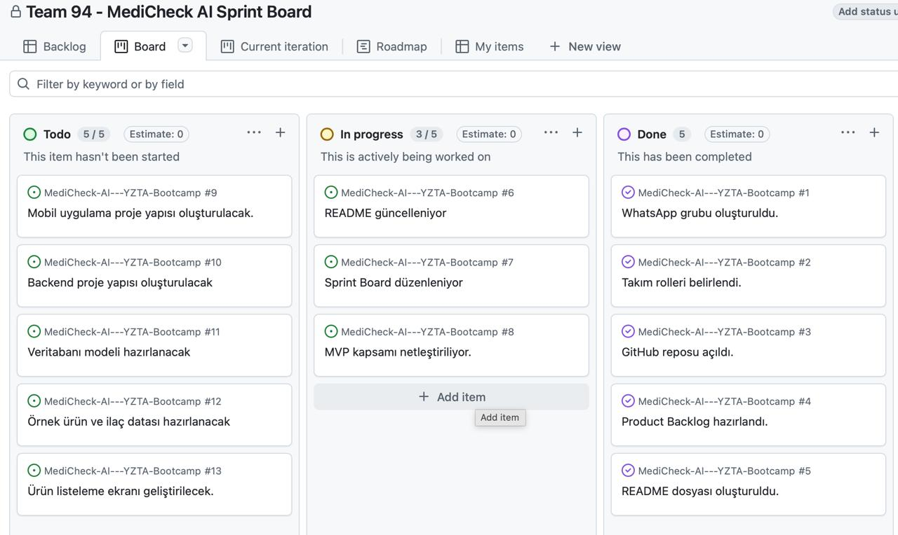

---

## Ürün Durumu

Sprint 1 sonunda MediCheck AI fikir, kapsam ve planlama aşamasındadır.

### Tamamlanan Çalışmalar

- Ürün fikri belirlendi.
- Ürün ismi seçildi.
- Takım rolleri netleştirildi.
- Mobil uygulama geliştirilmesine karar verildi.
- Product Backlog’un ilk hali oluşturuldu.
- GitHub README dokümantasyonu hazırlandı.

### Henüz Tamamlanmayan Çalışmalar

- Mobil uygulama proje kurulumu
- Backend proje kurulumu
- Veritabanı bağlantısı
- Ürün listeleme ekranı
- İlaç detay ekranı
- Dermokozmetik ürün detay ekranı
- Yapay zeka asistanı
- Ürün karşılaştırma özelliği

Bu çalışmalar Sprint 2 ve Sprint 3 kapsamında geliştirilecektir.

---

## Sprint Review

Sprint 1’de ekip olarak öncelikle proje fikri, rol dağılımı ve ürün kapsamı üzerinde çalışılmıştır.

Bu sprint sonunda:

- Takım içi iletişim kanalı oluşturuldu.
- Scrum Master ve Product Owner rolleri belirlendi.
- İlk proje fikri değerlendirildi.
- Ekip motivasyonu ve ürünleşme potansiyeli açısından daha güçlü bir fikir ihtiyacı olduğu görüldü.
- MediCheck AI fikrine pivot edildi.
- Mobil uygulama geliştirilmesine karar verildi.
- Product Backlog oluşturuldu.
- GitHub README dokümantasyonu hazırlandı.

Sprint 1 sonucunda ürünün teknik geliştirme aşamasına geçebilmesi için gerekli temel planlama tamamlanmıştır.

---

## Sprint Retrospective

### İyi Gidenler

- Ekip içi iletişim hızlıca kuruldu.
- Roller netleşti.
- Proje fikri üzerine aktif tartışma yapıldı.
- İlk fikre bağlı kalınmadan daha güçlü bir fikre pivot edildi.
- Ürün kapsamı daha net hale getirildi.

### Geliştirilmesi Gerekenler

- Teknik geliştirmeye daha hızlı başlanmalı.
- Sprint Board daha aktif kullanılmalı.
- Görev dağılımı daha detaylı yapılmalı.
- Ürün ekranları için wireframe hazırlanmalı.
- Veritabanı modeli netleştirilmeli.
- Yapay zeka entegrasyon kapsamı daha teknik hale getirilmeli.

### Bir Sonraki Sprint İçin Aksiyonlar

- Mobil uygulama projesi oluşturulacak.
- Backend projesi oluşturulacak.
- Veritabanı modeli hazırlanacak.
- Ürün ve ilaç veri yapısı belirlenecek.
- Örnek ürün ve ilaç verileri hazırlanacak.
- Ürün listeleme ekranı geliştirilecek.
- Ürün detay ekranı geliştirilecek.
- İlaç detay ekranı için ilk yapı kurulacak.
- Yapay zeka asistanının ilk prototipi hazırlanacak.


---

# Sprint 2

## Sprint 2 Amacı

Sprint 2’nin temel amacı, Sprint 1’de planlanan MediCheck AI fikrini teknik bir demo seviyesine taşımak ve mobil uygulamanın temel kullanıcı akışlarını çalışır hale getirmektir.

Bu sprintte öncelik; Flutter proje yapısının oluşturulması, ana sayfa, ürün listeleme, arama, kategori filtreleme, ürün detay ekranı ve mock AI analiz yapısının hazırlanmasına verilmiştir.

Sprint 2 sonunda proje, fikir ve planlama aşamasından çıkarak gösterilebilir bir mobil demo haline getirilmiştir.

---

## Sprint 2 Kapsam Kararı

Sprint 2 sürecinde MVP kapsamı yeniden değerlendirilmiştir. Bootcamp süresi, demo önceliği ve geliştirme yükü dikkate alınarak Firebase Auth ve Firebase Storage kullanımı mevcut MVP kapsamından çıkarılmıştır.

Bu karar doğrultusunda:

- Kullanıcı hesabı / giriş-kayıt sistemi Sprint 2 kapsamına alınmamıştır.
- Ürün görselleri ve demo verileri local/static veri yaklaşımıyla ele alınmıştır.
- Mobil uygulama, kullanıcı girişi gerektirmeyen demo akışı üzerinden geliştirilmiştir.
- Backend, PostgreSQL ve gerçek Gemini API entegrasyonu Sprint 3 kapsamına taşınmıştır.
- Sprint 2’de AI tarafı, güvenli prompt yapısına sahip mock AI analiz sistemiyle temsil edilmiştir.

Bu sadeleştirme ile Sprint 2’de temel ürün deneyimini gösterebilen, çalışır ve test edilebilir bir Flutter demosu hazırlanması hedeflenmiştir.

---

## Sprint 2 Backlog

| Öncelik | Backlog Item | Açıklama | Durum |
|---|---|---|---|
| P0 | Flutter proje iskeletinin oluşturulması | Mobil uygulama temel proje yapısının hazırlanması | Tamamlandı |
| P0 | Ana sayfa geliştirme | Kullanıcının ürün kategorilerine ve arama alanına ulaşabileceği ana ekranın hazırlanması | Tamamlandı |
| P0 | Ürün listeleme ekranı | Güneş kremi ve ilaç verilerinin listelenmesi | Tamamlandı |
| P0 | Arama özelliği | Kullanıcının ürün adına göre arama yapabilmesi | Tamamlandı |
| P0 | Kategori filtreleme | Ürünlerin ilaç ve güneş kremi kategorilerine göre filtrelenmesi | Tamamlandı |
| P0 | Ürün detay ekranı | Ürün içeriklerinin, kullanım bilgilerinin, uyarıların ve AI analiz alanının gösterilmesi | Tamamlandı |
| P0 | Demo veri seti | 5 güneş kremi ve 2 ilaçtan oluşan JSON veri setinin hazırlanması | Tamamlandı |
| P0 | Mock AI analiz servisi | Gerçek Gemini entegrasyonu öncesi AI analiz yapısının mock servis ile hazırlanması | Tamamlandı |
| P0 | Güvenli AI prompt yapısı | Tıbbi tanı, tedavi ve doz önerisini engelleyen güvenli prompt kurallarının hazırlanması | Tamamlandı |
| P0 | AI analiz kartı | Ürün detay ekranında AI analiz sonucunun gösterilmesi | Tamamlandı |
| P0 | Loading / error / retry durumları | AI analiz sonucunun yüklenme, hata ve tekrar deneme durumlarının yönetilmesi | Tamamlandı |
| P0 | Tıbbi uyarı metni | AI çıktılarının bilgilendirme amaçlı olduğunu belirten disclaimer metninin gösterilmesi | Tamamlandı |
| P1 | Testlerin yazılması | Model, servis, prompt ve widget seviyesinde testlerin hazırlanması | Tamamlandı |
| P1 | Web build kontrolü | Flutter uygulamasının web için derlenebilir olduğunun kontrol edilmesi | Tamamlandı |
| P1 | Kullanıcı hikâyeleri ve kabul kriterleri | MVP özellikleri için kullanıcı hikâyelerinin ve kabul kriterlerinin yazılması | Tamamlandı |
| P1 | Sprint 2 README güncellemesi | Sprint 2 sürecinin README’ye eklenmesi | Tamamlandı |
| P1 | Sprint Board güncellemesi | Güncel görev durumlarının board üzerinde düzenlenmesi | Tamamlandı |
| P2 | Gerçek Gemini API entegrasyonu | Mock AI yerine gerçek Gemini API bağlantısının kurulması | Sprint 3’e Taşındı |
| P2 | FastAPI backend kurulumu | Mobil uygulamanın bağlanacağı backend servisinin oluşturulması | Sprint 3’e Taşındı |
| P2 | PostgreSQL veri modeli | Ürün, içerik ve ilaç verileri için ilişkisel veritabanı yapısının kurulması | Sprint 3’e Taşındı |
| P2 | Ürün karşılaştırma | İki dermokozmetik ürünün karşılaştırılması | Sprint 3’e Taşındı |
| P2 | Favoriler | Kullanıcının ürün veya ilaçları kaydedebilmesi | Sprint 3 / Opsiyonel |
| P2 | QR / Profil butonları | Placeholder durumda olan butonların işlevlendirilmesi veya kaldırılması | Sprint 3 / Opsiyonel |

---

## Backlog Dağıtma Mantığı

Sprint 2 backlog dağıtımı yapılırken öncelik, ürünün temel demo akışını oluşturacak görevlere verilmiştir.

Önceliklendirme yapılırken şu kriterler dikkate alınmıştır:

- Kullanıcının uygulamayı açtığında temel ürün deneyimini görebilmesi
- Mobil arayüzde ana sayfa, listeleme ve detay akışının çalışır hale gelmesi
- Demo için kullanılabilecek örnek ürün ve ilaç verilerinin hazırlanması
- Yapay zeka kullanımının gerçek API yerine güvenli mock yapı ile temsil edilebilmesi
- Sağlık alanına uygun tıbbi uyarıların ve güvenli cevap yaklaşımının korunması
- Flutter tarafında test edilebilir ve genişletilebilir bir temel yapı oluşturulması
- Sprint 3 için backend, gerçek Gemini entegrasyonu ve karşılaştırma özelliklerine zemin hazırlanması

Bu nedenle Sprint 2’de öncelik, backend ve gerçek AI entegrasyonundan önce mobil demo, veri gösterimi ve mock AI analiz altyapısına verilmiştir.

---

## Sprint 2 Görev Dağılımı

### Pelin Yaşar — Scrum Master / AI & Test Desteği

- Sprint 2 sürecinin genel takibini yaptı.
- AI analiz modeli ve mock AI servis yapısına katkı sağladı.
- Güvenli AI prompt kurallarının hazırlanmasına destek oldu.
- Tıbbi tanı, tedavi ve doz önerisini engelleyen güvenli cevap yaklaşımını oluşturdu.
- AI analiz kartının ürün detay ekranına entegre edilmesine katkı sağladı.
- Loading, success, error ve retry durumlarının test edilmesine destek oldu.
- Model, servis, prompt ve widget testlerinin hazırlanmasına katkı sağladı.
- Sprint 2 README ve süreç dokümantasyonu için gerekli çıktıları toparladı.

### Irmak Gündüz — Product Owner / Veri & Ürün Kapsamı

- MediCheck AI ürün kapsamının MVP düzeyinde netleştirilmesine katkı sağladı.
- Ürün detay ekranlarında gösterilecek bilgilerin belirlenmesine destek oldu.
- Demo veri setinde yer alacak ürün ve ilaç alanlarının ürün ihtiyacına uygunluğunu değerlendirdi.
- Sağlık bilgilendirme dilinin sade, kullanıcı dostu ve tıbbi tavsiye vermeyen yapıda kalmasına destek oldu.
- Kullanıcı hikâyeleri ve kabul kriterlerinin hazırlanmasına katkı sağladı.
- Ürün deneyimi açısından listeleme, detay ve AI analiz akışının değerlendirilmesine destek oldu.

### Seymen Budak — Developer / Mobile & UI

- Flutter mobil uygulama arayüzünün geliştirilmesine katkı sağladı.
- Ana sayfa ve ürün listeleme arayüzünü geliştirdi.
- Ürün kartı bileşenlerinin hazırlanmasına katkı sağladı.
- Ürün detay ekranının geliştirilmesine destek oldu.
- Arama ve kategori filtreleme özelliklerini uygulamaya ekledi.
- JSON tabanlı ürün servisinin hazırlanmasına katkı sağladı.
- Mobil arayüz ile AI analiz alanının birleşmesine temel sağladı.
- `main.dart` ve `pubspec.yaml` tarafındaki birleştirme/düzenleme süreçlerine katkı sağladı.

### Yusuf Emre Sucu — Data / QA / Destek

- Sprint 2 kapsamında veri, test ve ürün kontrol süreçlerine destek rolünde konumlandırıldı.
- Demo veri setinin incelenmesi ve ürün/ilaç bilgilerinin kontrol edilmesi görevlerinde destek sağladı.
- Uygulama ekranlarının manuel kontrol edilmesi ve eksiklerin belirlenmesi sürecine destek vermesi planlandı.
- Sprint 3 için backend, veri yapısı ve QA tarafında daha görünür katkı oluşturulması hedeflendi.

> Not: Sprint 2 sonunda Git geçmişinde bazı ekip üyelerinin bireysel commit katkıları görünür değildir. Bu durum, ekip içi katkı olmadığı anlamına gelmemekle birlikte, sonraki sprintte görevlerin commit, dokümantasyon veya test notları ile daha görünür hale getirilmesi hedeflenmektedir.

---

## Daily Scrum Notları

### Daily Scrum 1

**Katılımcılar:** Pelin Yaşar, Irmak Gündüz, Seymen Budak, Yusuf Emre Sucu

- Sprint 1 sonunda alınan geri bildirimler değerlendirildi.
- Daily Scrum notlarına katılımcı listesi eklenmesi gerektiği kararlaştırıldı.
- Sprint 2’de teknik çıktıların daha görünür hale getirilmesi hedeflendi.
- Firebase Auth/Storage kullanımının MVP için gereksiz yük oluşturacağı değerlendirildi.
- Sprint 2 odağının Flutter demo, JSON veri seti ve mock AI analiz sistemi olmasına karar verildi.

### Daily Scrum 2

**Katılımcılar:** Pelin Yaşar, Irmak Gündüz, Seymen Budak

- Flutter uygulama yapısı üzerinde çalışıldı.
- Ana sayfa, ürün listeleme ve ürün kartı yapıları planlandı.
- Ürün ve ilaç verilerinin JSON formatında tutulmasına karar verildi.
- Demo için 5 güneş kremi ve 2 ilaçlık veri seti hazırlanması hedeflendi.
- Product Owner tarafında ürün detayında gösterilecek alanlar değerlendirildi.

### Daily Scrum 3

**Katılımcılar:** Pelin Yaşar, Seymen Budak

- Ürün detay ekranı ve AI analiz alanı üzerinde çalışıldı.
- Mock AI analiz servisinin gerçek Gemini entegrasyonu öncesi kullanılmasına karar verildi.
- AI cevaplarında tıbbi tanı, tedavi ve doz önerisi verilmemesi gerektiği netleştirildi.
- Disclaimer metninin görünür şekilde gösterilmesi kararlaştırıldı.
- Loading, error ve retry durumlarının kullanıcı deneyimi açısından gerekli olduğu belirlendi.

### Daily Scrum 4

**Katılımcılar:** Pelin Yaşar, Irmak Gündüz, Seymen Budak

- Arama ve kategori filtreleme özellikleri değerlendirildi.
- Ürün detay ekranında gösterilen içeriklerin kullanıcı için sade ve anlaşılır olması gerektiği konuşuldu.
- AI analiz kartının ürün detay ekranına yerleştirilmesi değerlendirildi.
- Bazı placeholder butonların Sprint 3’e taşınmasına karar verildi.
- Sprint 2 sonunda teknik demo ve dokümantasyonun birlikte teslim edilmesi gerektiği not edildi.

### Daily Scrum 5

**Katılımcılar:** Pelin Yaşar, Seymen Budak

- `flutter analyze` ve test süreçleri değerlendirildi.
- Model, servis, prompt ve widget testlerinin durumu kontrol edildi.
- Web build alınarak projenin derlenebilirliği doğrulandı.
- Sprint 2 README, Sprint Board görseli, Review ve Retrospective bölümlerinin tamamlanması gerektiği belirlendi.
- Sprint 3 için gerçek Gemini API, FastAPI backend ve PostgreSQL yapısının planlanmasına karar verildi.

---

## Sprint Board Updates

Sprint 2 sürecinde görevler GitHub Projects üzerinden takip edilmiştir. Sprint 1 sonunda yer alan planlama odaklı kartlar güncellenmiş, Sprint 2 sonunda teknik demo çıktıları ve kalan işler yeniden sınıflandırılmıştır.

### Tamamlanan Görevler

- Flutter proje iskeleti oluşturuldu.
- Ana sayfa geliştirildi.
- Ürün listeleme ekranı geliştirildi.
- Ürün detay ekranı geliştirildi.
- Arama özelliği eklendi.
- Kategori filtreleme eklendi.
- JSON tabanlı ürün servisi hazırlandı.
- 5 güneş kremi ve 2 ilaçlık demo veri seti hazırlandı.
- Mock AI analiz servisi hazırlandı.
- Güvenli AI prompt yapısı oluşturuldu.
- AI analiz kartı ürün detay ekranına eklendi.
- AI analizinde loading, success, error ve retry durumları hazırlandı.
- Tıbbi uyarı / disclaimer metni görünür hale getirildi.
- Model, servis, prompt ve widget testleri eklendi.
- `flutter analyze` hatasız çalıştırıldı.
- 10 testin tamamı başarılı oldu.
- Web build başarılı şekilde alındı.

### Devam Eden Görevler

- Sprint 2 README güncellemesi
- Güncel Sprint Board görselinin eklenmesi
- Ürün ekran görüntülerinin README’ye eklenmesi
- Kullanıcı hikâyeleri ve kabul kriterlerinin dokümante edilmesi
- QA/test notlarının README’ye eklenmesi
- Ürün verilerindeki kesin sağlık ifadelerinin gözden geçirilmesi
- Placeholder butonların Sprint 3 için değerlendirilmesi

### Sprint 3’e Taşınan Görevler

- FastAPI backend kurulumu
- PostgreSQL veri modeli
- Gerçek Gemini API entegrasyonu
- AI soru-cevap asistanının tamamlanması
- Ürün karşılaştırma özelliği
- Favoriler özelliği
- QR / Profil gibi placeholder butonların işlevlendirilmesi veya kaldırılması
- Demo veri setinin genişletilmesi
- Veri kaynaklarının ve referansların eklenmesi

### Sprint Board Görseli

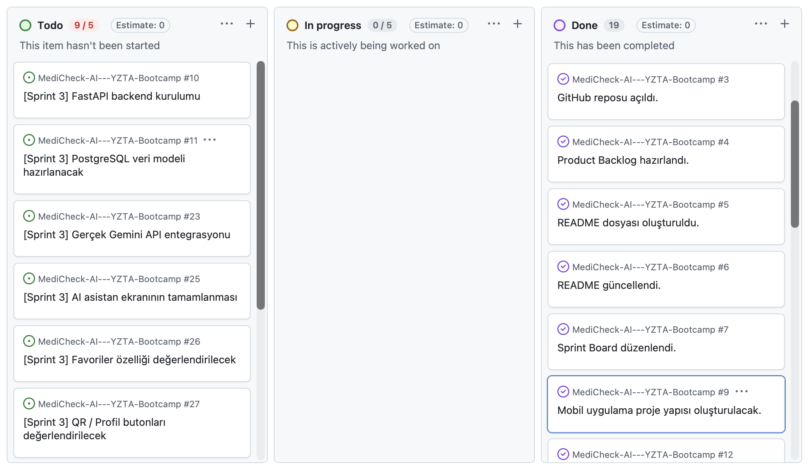

---

## Ürün Durumu

Sprint 2 sonunda MediCheck AI, planlama aşamasından çıkarak çalışan bir Flutter demo uygulaması haline gelmiştir.

### Tamamlanan Ürün Çıktıları

- Flutter uygulaması çalışır hale getirildi.
- Ana sayfa oluşturuldu.
- Ürün listeleme ekranı oluşturuldu.
- Ürün detay ekranı oluşturuldu.
- Ürün adına göre arama özelliği eklendi.
- Kategori filtreleme özelliği eklendi.
- 5 güneş kremi ve 2 ilaçtan oluşan JSON demo veri seti hazırlandı.
- Ürün detay ekranında ürün içerikleri, kullanım bilgileri, uyarılar ve AI analiz alanı gösterildi.
- Mock AI analiz sistemi ürün detay ekranına entegre edildi.
- Güneş kremi ve ilaçlar için farklı mock analiz çıktıları üretildi.
- AI analiz sonuçları için loading, success, error ve retry durumları hazırlandı.
- Tıbbi tavsiye verilmediğini belirten disclaimer görünür şekilde eklendi.
- Uygulama web için başarıyla derlendi.
- `flutter analyze` hatasız tamamlandı.
- 10 testin tamamı başarılı oldu.

### Ürün Ekran Görüntüleri

Aşağıdaki görseller Sprint 2 sonunda uygulamanın geldiği teknik demo durumunu göstermektedir.

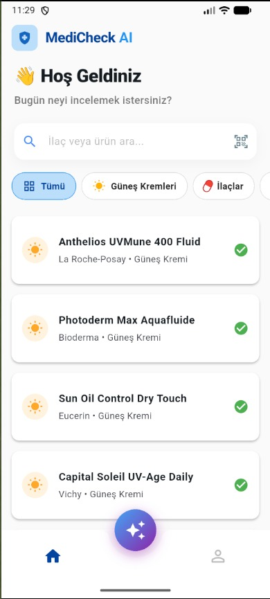

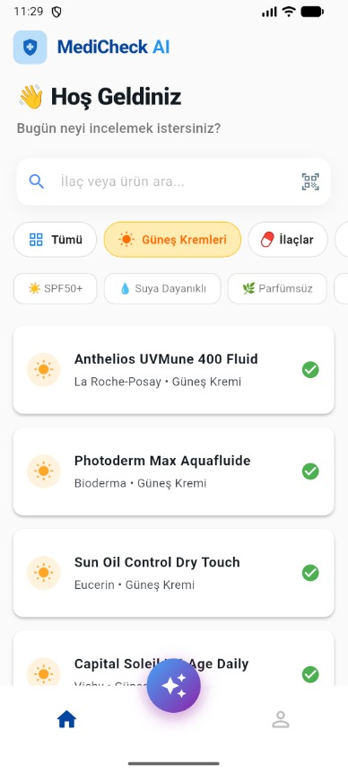

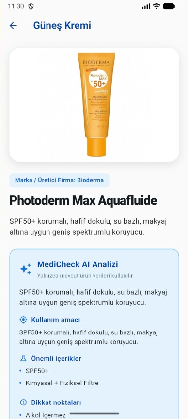

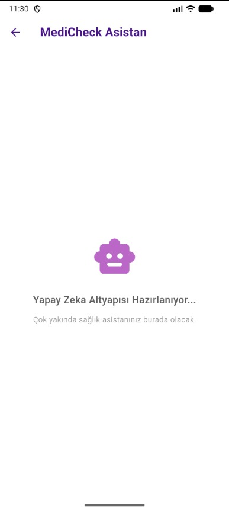

### Henüz Tamamlanmayan / Sprint 3’e Taşınan Ürün Çıktıları

- FastAPI backend kurulumu
- PostgreSQL veritabanı bağlantısı
- Gerçek Gemini API entegrasyonu
- AI soru-cevap asistanı ekranının tamamlanması
- Ürün karşılaştırma özelliği
- Favoriler sistemi
- QR ve profil butonlarının işlevlendirilmesi
- Veri kaynaklarının ve referansların eklenmesi
- Sağlık ifadelerinin daha güvenli ve kaynaklı hale getirilmesi

---

## Kullanıcı Hikâyeleri ve Kabul Kriterleri

### Kullanıcı Hikâyesi 1: Ürün Listeleme

**Kullanıcı olarak**, uygulamadaki dermokozmetik ürünleri ve ilaçları liste halinde görmek istiyorum, böylece incelemek istediğim ürünü kolayca seçebilirim.

**Kabul Kriterleri:**

- Kullanıcı ana sayfadan ürün listesine ulaşabilmelidir.
- Ürünler kart yapısı ile gösterilmelidir.
- Her kartta ürün adı, marka ve temel açıklama yer almalıdır.
- Liste demo JSON veri setinden beslenmelidir.

### Kullanıcı Hikâyesi 2: Arama

**Kullanıcı olarak**, ürün adına göre arama yapmak istiyorum, böylece aradığım ürüne daha hızlı ulaşabilirim.

**Kabul Kriterleri:**

- Kullanıcı arama alanına ürün adı yazabilmelidir.
- Arama sonucunda eşleşen ürünler listelenmelidir.
- Eşleşme bulunamazsa kullanıcıya boş sonuç durumu gösterilmelidir.
- Arama özelliği uygulamayı çökertmemelidir.

### Kullanıcı Hikâyesi 3: Kategori Filtreleme

**Kullanıcı olarak**, ürünleri ilaç veya güneş kremi kategorisine göre filtrelemek istiyorum, böylece ilgilendiğim ürün tipine daha hızlı ulaşabilirim.

**Kabul Kriterleri:**

- Kullanıcı kategori seçimi yapabilmelidir.
- Seçilen kategoriye uygun ürünler listelenmelidir.
- İlaç ve güneş kremi ayrımı doğru çalışmalıdır.
- Filtre sonucunda ürün yoksa kullanıcıya uygun boş durum gösterilmelidir.

### Kullanıcı Hikâyesi 4: Ürün Detayını Görüntüleme

**Kullanıcı olarak**, seçtiğim ürünün detaylarını görmek istiyorum, böylece içerik, kullanım ve uyarı bilgilerini daha anlaşılır şekilde inceleyebilirim.

**Kabul Kriterleri:**

- Kullanıcı ürün kartına tıklayarak detay ekranına ulaşabilmelidir.
- Detay ekranında ürün adı, marka, açıklama ve içerik bilgileri gösterilmelidir.
- İlaçlar için kullanım bilgisi, yan etki ve uyarı alanları gösterilmelidir.
- Güneş kremleri için filtre tipi, cilt tipi, alkol/parfüm bilgisi gibi alanlar gösterilmelidir.

### Kullanıcı Hikâyesi 5: AI Analiz Görüntüleme

**Kullanıcı olarak**, ürün detayında AI tarafından sadeleştirilmiş bir analiz görmek istiyorum, böylece teknik içerik bilgisini daha kolay anlayabilirim.

**Kabul Kriterleri:**

- Ürün detay ekranında AI analiz alanı yer almalıdır.
- AI analiz alanı loading durumunu gösterebilmelidir.
- Analiz başarılı olduğunda kullanıcıya anlaşılır bir özet sunulmalıdır.
- Hata durumunda kullanıcı tekrar deneme seçeneği görebilmelidir.
- AI çıktısında tıbbi tavsiye verilmediğini belirten uyarı gösterilmelidir.

---

## Test ve QA Notları

Sprint 2 sonunda proje üzerinde temel analiz, test ve build kontrolleri yapılmıştır.

### Çalıştırılan Kontroller

- `flutter analyze --no-pub`
- `flutter test --no-pub`
- `flutter build web --no-pub`

### Sonuçlar

| Kontrol | Sonuç |
|---|---|
| Flutter Analyze | Hatasız |
| Flutter Test | 10/10 başarılı |
| Flutter Web Build | Başarılı |
| Main Branch Durumu | Senkron |
| Conflict Durumu | Yok |

### Test Kapsamı

- AI sonuç modeli JSON dönüşümü
- Eksik ve hatalı alanlarda varsayılan değer kontrolü
- Güvenli prompt kuralları
- İlaç mock analizi
- Güneş kremi mock analizi
- Bilinmeyen ürün fallback davranışı
- Disclaimer kontrolü
- Loading durumu
- Başarılı analiz görünümü
- Hata ve retry görünümü

### QA Sırasında Belirlenen Eksikler

- AI asistan ekranı henüz tamamlanmadı; placeholder durumdadır.
- Favoriler butonu görünür durumdadır ancak sistem henüz çalışmamaktadır.
- QR butonu görünür durumdadır ancak aksiyonu tamamlanmamıştır.
- Profil butonu görünür durumdadır ancak aksiyonu tamamlanmamıştır.
- Bazı alt filtreler veri setiyle tam eşleşmediği için boş sonuç üretebilmektedir.
- Görsel yükleme hataları için fallback mekanizması eklenmelidir.
- Sağlık alanında kesinlik ifade eden bazı metinler yeniden gözden geçirilmelidir.
- `.DS_Store` dosyası repository takibinden çıkarılmalıdır.

---

## Sprint Review

Sprint 2’de ekip, MediCheck AI projesini teknik demo aşamasına taşımaya odaklanmıştır.

Bu sprint sonunda:

- Flutter uygulama iskeleti oluşturuldu.
- Ana sayfa, ürün listeleme ve ürün detay ekranları geliştirildi.
- Arama ve kategori filtreleme özellikleri eklendi.
- 5 güneş kremi ve 2 ilaçtan oluşan demo veri seti hazırlandı.
- JSON tabanlı ürün servisi oluşturuldu.
- Ürün detay ekranına mock AI analiz kartı eklendi.
- İlaç ve güneş kremi için farklı AI analiz çıktıları üretildi.
- Güvenli AI promptu ve tıbbi uyarı yaklaşımı oluşturuldu.
- AI analiz alanında loading, success, error ve retry durumları hazırlandı.
- `flutter analyze` hatasız tamamlandı.
- 10 testin tamamı başarılı oldu.
- Flutter web build başarılı şekilde alındı.

Sprint 2 sonunda ürün, temel kullanıcı akışını gösteren çalışır bir mobil demo haline gelmiştir. Bununla birlikte backend, gerçek Gemini API entegrasyonu, PostgreSQL veritabanı, ürün karşılaştırma ve favoriler gibi özellikler Sprint 3 kapsamına taşınmıştır.

---

## Sprint Retrospective

### İyi Gidenler

- Proje, planlama aşamasından çalışan teknik demo aşamasına taşındı.
- Flutter arayüzünde ana sayfa, listeleme ve detay akışı oluşturuldu.
- Demo veri seti hazırlanarak uygulamanın gerçekçi veriyle çalışması sağlandı.
- Mock AI analiz sistemi sayesinde gerçek Gemini entegrasyonu olmadan AI deneyimi temsil edildi.
- Güvenli prompt ve tıbbi uyarı yaklaşımı erken aşamada projeye dahil edildi.
- Test ve analiz sonuçları temiz alındı.
- Mobil arayüz ve AI analiz alanı aynı ürün detay ekranında birleştirildi.

### Zorlanılan Noktalar

- Ekip üyelerinin Flutter deneyiminin sınırlı olması geliştirme hızını etkiledi.
- Backend ve veritabanı kurulumu Sprint 2 süresinde tamamlanamadı.
- Gerçek Gemini API entegrasyonu yerine mock AI yapı kullanıldı.
- Bazı ekip üyelerinin katkıları Git commit geçmişinde görünür hale gelemedi.
- README ve Sprint Board güncellemeleri sprint sonuna kaldı.
- Favoriler, QR ve profil gibi placeholder butonlar tamamlanamadı.
- Sağlık ürünlerinde kullanılan bazı ifadelerin daha dikkatli ve kaynaklı hale getirilmesi gerektiği görüldü.

### Geliştirilmesi Gerekenler

- Sprint Board daha düzenli ve sprint boyunca güncel tutulmalı.
- Her ekip üyesinin katkısı commit, dokümantasyon, test notu veya veri dosyası ile görünür hale getirilmeli.
- Daily Scrum notları daha düzenli tutulmalı ve katılımcılar her toplantı için belirtilmeli.
- Ürün ekran görüntüleri sprint içinde README’ye daha erken eklenmeli.
- Placeholder butonlar ya çalışır hale getirilmeli ya da demo kapsamından çıkarılmalı.
- Sağlık ifadeleri kesin hüküm vermeyecek şekilde yeniden düzenlenmeli.
- Veri kaynakları ve referanslar eklenmeli.

### Bir Sonraki Sprint İçin Aksiyonlar

- FastAPI backend kurulacak.
- PostgreSQL veri modeli oluşturulacak.
- Gerçek Gemini API entegrasyonu backend üzerinden yapılacak.
- AI asistan ekranı placeholder durumdan çıkarılacak.
- Ürün karşılaştırma özelliği geliştirilecek.
- Demo veri seti genişletilecek.
- Ürün ve ilaç bilgilerinin kaynakları README’ye veya veri dosyasına eklenecek.
- `isSafe` gibi kesin güvenlik algısı oluşturabilecek ifadeler yeniden değerlendirilecek.
- Favoriler, QR ve profil butonları için karar verilecek: ya geliştirilecek ya da demo kapsamından çıkarılacak.
- `.DS_Store` repository takibinden çıkarılacak.
- Final demo videosu için kullanıcı akışı netleştirilecek.

---
# Sprint 3

## Sprint 3 Amacı

Sprint 3’ün temel amacı, Sprint 2 sonunda hazırlanan Flutter demo uygulamasını final MVP seviyesine taşımak ve projenin temel kullanıcı akışlarını tamamlamaktır.

Bu sprintte öncelik aşağıdaki çalışmalara verilmiştir:

- Demo veri setinin 10 güneş kremi ve 5 ilaca genişletilmesi
- Ürün ve ilaç bilgilerinin kaynaklandırılması
- Sağlık ifadelerinin daha güvenli ve temkinli hale getirilmesi
- Ürün karşılaştırma ekranının geliştirilmesi
- AI soru-cevap asistanının tamamlanması
- FastAPI backend’in hazırlanması
- Gemini API entegrasyonunun gerçekleştirilmesi
- Flutter uygulamasının FastAPI backend’e bağlanması
- Ürün görsellerinin yerel dosyalara taşınması
- Final test, analiz ve build kontrollerinin tamamlanması
- Sprint 3 dokümantasyonu ve final demo materyallerinin hazırlanması

Sprint 3 projenin son sprintidir. Bu nedenle kapsam, üç kişilik aktif ekip yapısı ve final teslim gereksinimleri dikkate alınarak düzenlenmiştir.

---

## Sprint 3 Teknik Kapsam Kararı
Irmak Gündüz’ün Sprint 3 sürecinde ekipten ayrılmasının ardından takım üç aktif üyeyle çalışmaya devam etmiştir.

Product Owner sorumlulukları, Scrum Master olan Pelin Yaşar tarafından devralınmıştır. Pelin Yaşar aynı zamanda Sprint 3’ün AI, backend, entegrasyon, veri, test ve teknik dokümantasyon çalışmalarının büyük bölümünü gerçekleştirmiştir.

Sprint 3 aktif ekibi:

| İsim | Sprint 3 Rolü |
|---|---|
| Pelin Yaşar | Scrum Master / Acting Product Owner / Lead Developer / AI, Backend & Integration |
| Seymen Budak | Flutter Developer / Mobile UI Prototype |
| Yusuf Emre Sucu | Data & Backend Prototype Support |

Sprint kapsamında çalışan Flutter final MVP, ürün karşılaştırma ekranı, AI analiz ve soru-cevap akışı, genişletilmiş veri seti, FastAPI backend, Gemini entegrasyonu ve final kalite kontrollerine öncelik verilmiştir.

Canlı PostgreSQL bağlantısı yerine veri modeli `schema.sql` dosyasıyla temsil edilmiştir.

Favoriler, QR, profil, barkod/OCR, kullanıcı hesabı ve kişisel cilt profili özellikleri final MVP kapsamı dışında bırakılmıştır.

---

## Sprint 3 Backlog

| Öncelik | Backlog Item | Açıklama | Durum |
|---|---|---|---|
| P0 | Sprint 3 rol güncellemesi | Üç kişilik aktif ekip yapısına göre rollerin yeniden düzenlenmesi | Tamamlandı |
| P0 | Demo veri setinin genişletilmesi | Veri setinin 10 güneş kremi ve 5 ilaca çıkarılması | Tamamlandı |
| P0 | Veri kaynaklarının eklenmesi | Ürün ve ilaç kayıtlarına kaynak bilgilerinin eklenmesi | Tamamlandı |
| P0 | AI promptlarının finalleştirilmesi | Teşhis, tedavi, reçete ve doz önerisini engelleyen promptların hazırlanması | Tamamlandı |
| P0 | AI güvenlik filtresi | Riskli sağlık sorularının güvenli yanıtlara yönlendirilmesi | Tamamlandı |
| P0 | Sağlık dilinin düzenlenmesi | Kesin sağlık ifadelerinin temkinli hale getirilmesi | Tamamlandı |
| P0 | AI asistan ekranı | Ürün ve ilaç bağlamlı soru-cevap akışının hazırlanması | Tamamlandı |
| P0 | Ürün karşılaştırma ekranı | İki güneş kreminin karşılaştırılabilmesi | Tamamlandı |
| P0 | AI karşılaştırma yorumu | Karşılaştırma ekranına güvenli AI yorumu eklenmesi | Tamamlandı |
| P0 | Placeholder temizliği | Çalışmayan favori, QR ve profil kontrollerinin kaldırılması veya pasifleştirilmesi | Tamamlandı |
| P0 | Görsel fallback | Görsel yüklenemediğinde yedek görünüm gösterilmesi | Tamamlandı |
| P0 | Boş sonuç ekranı | Arama veya filtre sonucu bulunamadığında açıklayıcı mesaj gösterilmesi | Tamamlandı |
| P0 | Yerel ürün görselleri | 10 güneş kremi ve 5 ilaç görselinin uygulamaya eklenmesi | Tamamlandı |
| P0 | Tıbbi bilgilendirme ekranı | Uygulama başlangıcına sağlık uyarısı eklenmesi | Tamamlandı |
| P0 | Flutter testleri | Model, servis, filtre, asistan ve kullanıcı akışlarının test edilmesi | Tamamlandı |
| P0 | Flutter analiz kontrolü | `flutter analyze` sonucunun doğrulanması | Tamamlandı |
| P0 | Flutter web build | Final web build’in oluşturulması | Tamamlandı |
| P0 | Sprint 3 README | Sprint 3 sürecinin README’ye eklenmesi | Hazırlandı |
| P0 | Sprint Board görseli | Güncel Sprint 3 Board ekran görüntüsünün eklenmesi | Teslim Öncesi Eklenecek |
| P0 | Final ekran görüntüleri | Uygulamanın final ekran görüntülerinin eklenmesi | Teslim Öncesi Eklenecek |
| P0 | Demo videosu | En fazla 3 dakikalık final demo videosunun hazırlanması | Teslim Öncesi Eklenecek |
| P1 | FastAPI backend | Mobil uygulamanın kullanacağı backend servisinin hazırlanması | Tamamlandı |
| P1 | `/health` endpointi | Backend servis durumunun döndürülmesi | Tamamlandı |
| P1 | `/products` endpointi | 10 güneş kreminin listelenmesi | Tamamlandı |
| P1 | `/products/{id}` endpointi | Tek bir güneş kreminin döndürülmesi | Tamamlandı |
| P1 | `/medicines` endpointi | 5 ilacın listelenmesi | Tamamlandı |
| P1 | `/medicines/{id}` endpointi | Tek bir ilacın döndürülmesi | Tamamlandı |
| P1 | `/ai/analyze` endpointi | Ürün veya ilaç için yapılandırılmış analiz üretilmesi | Tamamlandı |
| P1 | `/ai/ask` endpointi | Ürün bağlamlı güvenli AI cevabının döndürülmesi | Tamamlandı |
| P1 | `/ai/compare-products` endpointi | İki güneş kremi için karşılaştırma cevabının döndürülmesi | Tamamlandı |
| P1 | Gemini API entegrasyonu | Gemini servisinin FastAPI backend üzerinden bağlanması | Tamamlandı |
| P1 | Gemini fallback sistemi | Gemini kullanılamadığında güvenli cevap üretilmesi | Tamamlandı |
| P1 | Flutter–FastAPI bağlantısı | Flutter uygulamasının backend servislerine bağlanması | Tamamlandı |
| P1 | Backend README | Backend kurulum ve çalıştırma komutlarının yazılması | Tamamlandı |
| P1 | Swagger dokümantasyonu | Backend endpointlerinin Swagger üzerinden gösterilmesi | Tamamlandı |
| P1 | PostgreSQL şeması | Kalıcı veri yapısı için `schema.sql` hazırlanması | Tamamlandı |
| P1 | Backend testleri | API ve Gemini fallback davranışlarının test edilmesi | Tamamlandı |
| Kapsam Dışı | Canlı PostgreSQL bağlantısı | Final MVP için zorunlu görülmediği için canlı bağlantının kurulmaması | Final MVP Kapsamı Dışında |
| Kapsam Dışı | Favoriler | Kalıcı kullanıcı sistemi gerektirdiği için çıkarılması | Final MVP Kapsamı Dışında |
| Kapsam Dışı | QR ve profil | Final demo akışında kullanılmadığı için çıkarılması | Final MVP Kapsamı Dışında |
| Kapsam Dışı | Barkod/OCR | Sprint süresi nedeniyle çıkarılması | Final MVP Kapsamı Dışında |
| Kapsam Dışı | Kullanıcı hesabı | Giriş ve kayıt sisteminin final MVP’ye alınmaması | Final MVP Kapsamı Dışında |

---

## Backlog Dağıtma Mantığı

Sprint 3 backlog dağıtımı yapılırken öncelik, final demoda doğrudan gösterilebilecek ve ürünün ana kullanım senaryosunu tamamlayacak görevlere verilmiştir.

Önceliklendirme sırasında aşağıdaki kriterler dikkate alınmıştır:

- Sprint 3’ün projenin son sprinti olması
- Aktif ekibin üç kişiden oluşması
- Kullanıcının uygulamanın temel akışını baştan sona deneyimleyebilmesi
- Yapay zekâ kullanımının final demoda görünür olması
- Sağlık alanında güvenli ve bilgilendirici dil kullanılması
- Çalışmayan veya yarım bırakılmış kullanıcı kontrolü bulunmaması
- Ürün karşılaştırma özelliğinin tamamlanması
- Flutter uygulamasının gerçek backend servisleriyle çalışabilmesi
- Gemini API anahtarının mobil uygulamada bulunmaması
- Gemini kullanılamadığında uygulamanın çalışmaya devam edebilmesi
- Test, build ve dokümantasyon çıktılarının hazırlanması

Bu nedenle kullanıcı hesapları, kalıcı favoriler, QR, profil, barkod/OCR ve canlı PostgreSQL bağlantısı gibi final demo için zorunlu olmayan özellikler kapsam dışında bırakılmıştır.

---
## Sprint 3 Görev Dağılımı

Sprint 3 görev dağılımı, başlangıçta hazırlanan teknik planın yanı sıra Git commit geçmişinde görülen gerçek katkılar dikkate alınarak güncellenmiştir.

### Pelin Yaşar — Scrum Master / Acting Product Owner / Lead Developer / AI, Backend & Integration

Pelin Yaşar, Sprint 3 sürecinde Scrum Master ve Acting Product Owner görevlerinin yanı sıra final sistemin teknik geliştirme çalışmalarının büyük bölümünü gerçekleştirmiştir.

#### Sprint Yönetimi ve Product Owner Çalışmaları

- Irmak Gündüz’ün ekipten ayrılmasının ardından Product Owner görevlerini devraldı.
- Sprint 3 kapsamını üç kişilik aktif ekip yapısına göre yeniden düzenledi.
- Sprint görevlerinin P0, P1 ve kapsam dışı olarak önceliklendirilmesini sağladı.
- Sprint 3 teknik planını ve görev durumlarını takip etti.
- Final MVP kapsamına alınacak ve çıkarılacak özellikleri belirledi.
- Ürün kararlarını, kabul kriterlerini ve final demo akışını kontrol etti.
- Sprint 3 README, Sprint Review ve Sprint Retrospective içeriklerini hazırladı.
- Proje analizini ve kalıcı teknik bağlamı `AGENTS.md` dosyasında dokümante etti.

#### AI ve Gemini Çalışmaları

- Güvenli AI promptlarını hazırladı ve final hale getirdi.
- Teşhis, tedavi, reçete ve doz önerisini engelleyen güvenlik kurallarını geliştirdi.
- AI güvenlik filtresini hazırladı.
- Mock AI analiz cevaplarını final demo kalitesine getirdi.
- Ürün ve ilaç bağlamlı AI asistan sistemini geliştirdi.
- AI asistanın domain, data ve presentation katmanlarını oluşturdu.
- Ürün karşılaştırması için mock ve remote AI servislerini geliştirdi.
- AI analiz servisinin remote backend bağlantısını hazırladı.
- Gemini API entegrasyonunu FastAPI backend üzerinden gerçekleştirdi.
- Gemini model, token ve düşünme seviyesi yapılandırmasını ortam değişkenlerine taşıdı.
- API anahtarının Flutter kaynak koduna ve GitHub reposuna eklenmesini engelledi.
- Gemini hata, kota veya bağlantı problemlerinde devreye giren fallback sistemini geliştirdi.
- AI analiz, soru-cevap ve karşılaştırma cevap modellerini hazırladı.
- Gerçek Gemini bağlantısının çalışmasını test etti.

#### Backend Çalışmaları

- FastAPI backend’in final proje yapısını oluşturdu.
- Backend uygulama ve AI servis katmanlarını hazırladı.
- `/health` endpointini geliştirdi.
- `/products` ve `/products/{id}` endpointlerini geliştirdi.
- `/medicines` ve `/medicines/{id}` endpointlerini geliştirdi.
- `/ai/analyze` endpointini geliştirdi.
- `/ai/ask` endpointini geliştirdi.
- `/ai/compare-products` endpointini geliştirdi.
- API istek ve cevap modellerini hazırladı.
- AI güvenlik kontrollerini backend’e bağladı.
- CORS yapılandırmasını hazırladı.
- `.env.example` dosyasını hazırladı.
- Backend kurulum ve çalıştırma dokümantasyonunu hazırladı.
- PostgreSQL veri modeli için `backend/schema.sql` dosyasını hazırladı.
- Backend API ve Gemini servis testlerini geliştirdi.
- Swagger ve OpenAPI rotalarını doğruladı.

#### Flutter ve Entegrasyon Çalışmaları

- Flutter uygulamasını FastAPI ürün ve ilaç endpointlerine bağladı.
- Flutter AI servislerini remote backend yapısına bağladı.
- Backend kullanılamadığında mock fallback servislerinin çalışmasını sağladı.
- Final ürün karşılaştırma mimarisini oluşturdu.
- AI asistan ekranını final servis yapısına bağladı.
- Ana sayfa, ürün detay ekranı ve ürün servislerini backend yapısına uygun hale getirdi.
- Sprint 3 veri setiyle uyumlu filtre servisini geliştirdi.
- Arama ve kategori filtrelerinin genişletilmiş veri setiyle doğru çalışmasını sağladı.
- Tıbbi bilgilendirme/onboarding ekranını geliştirdi.
- Tıbbi bilgilendirme ekranını uygulamanın başlangıç akışına bağladı.
- Ana sayfa ve ürün detay ekranındaki sağlık uyarılarını güncelledi.
- Uygulama akışı ve onboarding widget testlerini hazırladı.
- Android, iOS ve web proje yapılandırmalarını final proje yapısına uygun hale getirdi.
- Kullanılmayan veya yinelenen eski dosyaları temizledi.

#### Veri Seti ve Ürün Görselleri

- Demo veri setini 10 güneş kremi ve 5 ilaç olacak şekilde final hale getirdi.
- Ürün ve ilaç kayıtlarını ortak JSON veri yapısında birleştirdi.
- Veri alanlarını Flutter modeli ve FastAPI endpointleriyle uyumlu hale getirdi.
- Ürün ve ilaç bilgilerine kaynak ve referans alanları ekledi.
- Kesin sağlık ifadelerini daha temkinli hale getirdi.
- Veri seti için otomatik testler hazırladı.
- 10 güneş kremi ve 5 ilaç için kaliteli yerel ürün görsellerini buldu ve projeye ekledi.
- Ürün verilerindeki görsel yollarını yerel asset dosyalarına yönlendirdi.
- Ortak `ProductImage` bileşenini geliştirdi.
- Ürün kartı ve detay ekranlarını yerel görselleri kullanacak şekilde güncelledi.
- Yerel ve internet tabanlı görseller için fallback desteği ekledi.
- Görsel kaynaklarını `IMAGE_SOURCES.md` dosyasında dokümante etti.
- `pubspec.yaml` dosyasına ürün görselleri asset yolunu ekledi.

#### Test, QA ve Repo Düzenleme Çalışmaları

- Flutter model, servis, filtre, AI, karşılaştırma ve uygulama akışı testlerini hazırladı.
- Backend endpoint ve Gemini servis testlerini hazırladı.
- `flutter analyze` kontrolünü gerçekleştirdi.
- Flutter testlerini çalıştırdı ve 34 testin başarılı olduğunu doğruladı.
- Backend testlerini çalıştırdı ve 14 testin başarılı olduğunu doğruladı.
- Flutter web build’i başarıyla oluşturdu.
- WebAssembly uyumluluk kontrolünü gerçekleştirdi.
- Backend sağlık, ürün, ilaç ve AI endpointlerini doğruladı.
- Gemini entegrasyonu ve fallback davranışını doğruladı.
- Repository içindeki geçici ve yinelenen dosyaları temizledi.
- `.gitignore` dosyasını hazırladı ve gizli dosyaların repository’ye eklenmesini engelledi.
- Sprint 3 değişikliklerini ayrı bir entegrasyon dalında birleştirerek Pull Request üzerinden `main` dalına aktardı.
- Ürün görsellerini ayrı bir commit ile GitHub’a gönderdi.
- README güncellemelerini GitHub üzerinden gerçekleştirdi.

> Git geçmişinde Pelin Yaşar’ın Sprint 3 kapsamında AI, Gemini, FastAPI, veri seti, Flutter-backend bağlantısı, filtreler, onboarding, testler, proje düzenleme, yerel ürün görselleri ve README çalışmalarını içeren çok sayıda commit’i bulunmaktadır. Final teknik sistemin büyük bölümü Pelin Yaşar tarafından tamamlanmıştır.

### Seymen Budak — Flutter Developer / Mobile UI Prototype

Seymen Budak, Sprint 3’ün başlangıcında mobil kullanıcı arayüzü ve demo akışı için ilk Flutter prototipini hazırlamıştır.

- İlk ürün karşılaştırma ekranı prototipini geliştirdi.
- Ana sayfada karşılaştırma akışı için ilk kullanıcı arayüzünü hazırladı.
- Ürün detay ekranının Sprint 3 arayüz düzenlemelerine katkı sağladı.
- AI sohbet alanının ilk mobil arayüz yapısına katkı sağladı.
- Ürün kartlarının görsel düzenini güncelledi.
- Görsel yükleme hataları için ilk fallback korumasını ekledi.
- Ana sayfa ve ürün detay ekranında kullanıcı arayüzü temizliği yaptı.
- Flutter bağımlılık ve Android yapılandırma dosyalarında gerekli düzenlemelere katkı sağladı.
  
> Seymen Budak’ın Sprint 3 katkıları `b1c571b` numaralı commit’te görünmektedir. Bu commit, karşılaştırma ekranının ve AI sohbet arayüzünün ilk prototipini içermektedir. Final karşılaştırma mimarisi, backend bağlantısı, AI servisleri ve testler daha sonra Pelin Yaşar tarafından geliştirilerek projeye entegre edilmiştir.

### Yusuf Emre Sucu — Data & Backend Prototype Support

Yusuf Emre Sucu, Sprint 3’ün başlangıcında veri ve backend için kullanılabilecek taslak dosyaları hazırlayarak projeye destek olmuştur.

- İlaçlar için taslak JSON veri dosyası hazırladı.
- Güneş kremleri için taslak JSON veri dosyası hazırladı.
- Genişletilmiş ürün verilerini içeren taslak veri dosyası hazırladı.
- Backend için kullanılabilecek ilk Python prototip dosyasını hazırladı.
- 10 güneş kremi ve 5 ilaç hedefi için ham veri desteği sağladı.
- Backend ve veri yapısının hazırlanmasına başlangıç materyali sundu.

> Yusuf Emre Sucu’nun Sprint 3 katkıları `be42d7e` ve `38fcad4` numaralı commitlerde görünmektedir. Bu commitlerde `medicinesjson.json`, `productsjson.json`, `finalproducts.json` ve `newmain.py` dosyaları bulunmaktadır. Bu taslak dosyalar daha sonra Pelin Yaşar tarafından incelenmiş, ortak veri modeline dönüştürülmüş, kaynaklandırılmış, test edilmiş ve final FastAPI/Flutter yapısına entegre edilmiştir. Entegrasyon tamamlandıktan sonra bağımsız taslak dosyalar repository’den kaldırılmıştır.

> Not: Irmak Gündüz Sprint 3 sürecinde ekipten ayrıldığı için Sprint 3 görev dağılımında aktif ekip üyesi olarak yer almamaktadır.

---
## Daily Scrum Notları

### Daily Scrum 1

**Katılımcılar:** Pelin Yaşar, Seymen Budak, Yusuf Emre Sucu

- Sprint 3 teknik planı değerlendirildi.
- Irmak Gündüz’ün ekipten ayrılmasının ardından takım rolleri güncellendi.
- Product Owner ve Scrum Master sorumluluklarının Pelin Yaşar tarafından birlikte yürütülmesine karar verildi.
- Sprint 3 kapsamı P0, P1 ve final MVP kapsamı dışındaki özellikler olarak ayrıldı.
- Veri seti, AI asistan, ürün karşılaştırma ve backend çalışmalarına öncelik verilmesi kararlaştırıldı.

### Daily Scrum 2

**Katılımcılar:** Pelin Yaşar, Seymen Budak, Yusuf Emre Sucu

- Seymen Budak’ın hazırladığı ilk karşılaştırma ve AI sohbet arayüzü değerlendirildi.
- Yusuf Emre Sucu’nun yüklediği taslak ürün, ilaç ve backend dosyaları incelendi.
- Taslak verilerin tek bir ortak veri dosyasında birleştirilmesine karar verildi.
- Pelin Yaşar, AI güvenlik yapısı, Gemini entegrasyonu ve final backend mimarisi üzerinde çalışmaya başladı.
- API anahtarının yalnızca backend ortam değişkenlerinde tutulmasına karar verildi.

### Daily Scrum 3

**Katılımcılar:** Pelin Yaşar, Seymen Budak, Yusuf Emre Sucu

- Pelin Yaşar tarafından FastAPI backend ve AI servisleri geliştirildi.
- Ürün ve ilaç endpointleri ortak veri dosyasına bağlandı.
- Flutter uygulaması FastAPI backend’e bağlandı.
- AI asistan ve karşılaştırma servisleri final mimariye taşındı.
- Veri seti 10 güneş kremi ve 5 ilaç olacak şekilde kaynaklandırıldı.
- Sağlık ifadeleri ve AI cevapları güvenli hale getirildi.

### Daily Scrum 4

**Katılımcılar:** Pelin Yaşar, Seymen Budak, Yusuf Emre Sucu

- Pelin Yaşar tarafından filtre servisi ve tıbbi bilgilendirme ekranı tamamlandı.
- Flutter ve backend testleri çalıştırıldı.
- Final web build doğrulandı.
- 15 yerel ürün görseli projeye eklendi.
- Görsel kaynakları dokümante edildi.
- Final kullanıcı akışı kontrol edildi.
- Sprint Board görseli, final ekran görüntüleri ve demo videosunun teslim öncesinde eklenmesi kararlaştırıldı.

---

## Sprint Board Updates

### Tamamlanan Görevler

- Sprint 3 rol dağılımı güncellendi.
- Demo veri seti 10 güneş kremi ve 5 ilaca genişletildi.
- Ürün ve ilaç bilgileri kaynaklandırıldı.
- Sağlık ifadeleri daha güvenli hale getirildi.
- AI promptları final hale getirildi.
- AI güvenlik filtresi geliştirildi.
- AI soru-cevap asistanı tamamlandı.
- Ürün karşılaştırma ekranı tamamlandı.
- AI karşılaştırma yorumu eklendi.
- Çalışmayan placeholder kontroller kaldırıldı veya pasifleştirildi.
- Görsel fallback sistemi eklendi.
- Boş sonuç ekranları düzenlendi.
- Tıbbi bilgilendirme ekranı eklendi.
- FastAPI backend tamamlandı.
- Ürün, ilaç ve AI endpointleri geliştirildi.
- Gemini API backend üzerinden entegre edildi.
- Gemini fallback sistemi hazırlandı.
- Flutter uygulaması FastAPI backend’e bağlandı.
- PostgreSQL `schema.sql` dosyası hazırlandı.
- Backend dokümantasyonu hazırlandı.
- Flutter ve backend testleri tamamlandı.
- Flutter web build başarıyla oluşturuldu.
- 10 güneş kremi ve 5 ilaç için yerel görseller eklendi.
- Görsel kaynakları dokümante edildi.
- Repository içindeki geçici ve yinelenen dosyalar temizlendi.
- Sprint 3 README bölümü hazırlandı.
- Sprint Review hazırlandı.
- Sprint Retrospective hazırlandı.

### Teslim Öncesinde Eklenecekler

- Sprint 3 Board ekran görüntüsü
- Final uygulama ekran görüntüleri
- Swagger ekran görüntüsü
- En fazla 3 dakikalık final demo videosu
- Demo videosunun README bağlantısı

### Final MVP Kapsamı Dışında Bırakılanlar

- Canlı PostgreSQL bağlantısı
- SQLAlchemy ve Alembic migration yapısı
- Kullanıcı giriş ve kayıt sistemi
- Kalıcı favoriler
- QR özelliği
- Profil özelliği
- Barkod/OCR özelliği
- Kişisel cilt profili

### Sprint Board Görseli

<!-- Sprint 3 Board ekran görüntüsü hazırlandıktan sonra aşağıdaki satır aktif hale getirilecektir. -->

<!-- 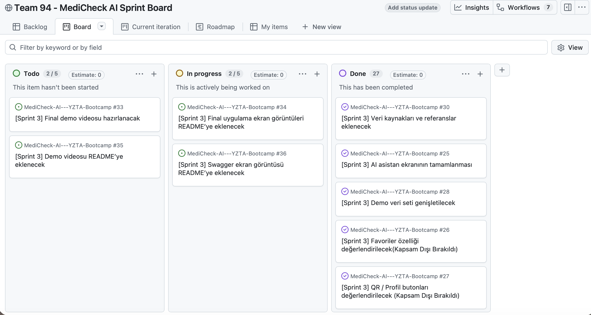 -->

---

## Ürün Durumu

Sprint 3 sonunda MediCheck AI, Flutter mobil uygulaması, FastAPI backend’i ve Gemini destekli yapay zekâ servisleri bulunan çalışır bir final MVP haline getirilmiştir.

### Tamamlanan Ürün Çıktıları

- 10 güneş kremi ve 5 ilaçtan oluşan kaynaklı veri seti hazırlandı.
- Ürün arama ve kategori filtreleme özellikleri güncellendi.
- Ürün detay ekranları tamamlandı.
- İki güneş kreminin karşılaştırılabildiği ekran tamamlandı.
- AI karşılaştırma yorumu eklendi.
- Ürün ve ilaç bağlamlı AI asistan tamamlandı.
- Tıbbi bilgilendirme ekranı eklendi.
- Sağlık güvenlik filtreleri geliştirildi.
- FastAPI backend tamamlandı.
- Ürün, ilaç ve AI endpointleri oluşturuldu.
- Flutter uygulaması backend servislerine bağlandı.
- Gemini API entegrasyonu tamamlandı.
- Gemini fallback sistemi eklendi.
- PostgreSQL veri şeması hazırlandı.
- Çalışmayan placeholder kontroller kaldırıldı veya pasifleştirildi.
- 15 yerel ürün görseli uygulamaya eklendi.
- Görsel fallback mekanizması geliştirildi.
- Flutter ve backend testleri başarıyla tamamlandı.
- Flutter web build başarıyla oluşturuldu.

### Sprint 3 Ürünleri

#### Güneş Kremleri

1. La Roche-Posay Anthelios UVMune 400 Fluid
2. Bioderma Photoderm Max Aquafluide
3. Eucerin Sun Oil Control Dry Touch
4. Vichy Capital Soleil UV-Age Daily
5. Avène Mineral Sunscreen Multi-Defense Fluid SPF50+
6. Vichy Capital Soleil UV-Clear SPF50+
7. Bioderma Photoderm AR SPF50+
8. Bioderma Photoderm Spot SPF50+
9. Bioderma Photoderm Cream SPF50+
10. Bioderma Photoderm Spot-Age SPF50+

#### İlaçlar

1. Bayer Aspirin 500 mg Tablet
2. Menarini Arveles 25 mg Film Tablet
3. Atabay Parol 500 mg Tablet
4. UCB Zyrtec 10 mg Film Kaplı Tablet
5. Buscopan 10 mg Kaplı Tablet

### Yerel Ürün Görselleri

Ürün görselleri aşağıdaki dizine eklenmiştir:

```text
medicheck_ai_flutter/assets/images/products/
```

Görsel kaynakları aşağıdaki dosyada dokümante edilmiştir:

```text
medicheck_ai_flutter/assets/IMAGE_SOURCES.md
```

> Ürün görsellerinin ticari kullanım ve telif koşulları, uygulamanın herkese açık olarak yayımlanmasından önce ayrıca kontrol edilmelidir.

### Ürün Ekran Görüntüleri

<!-- 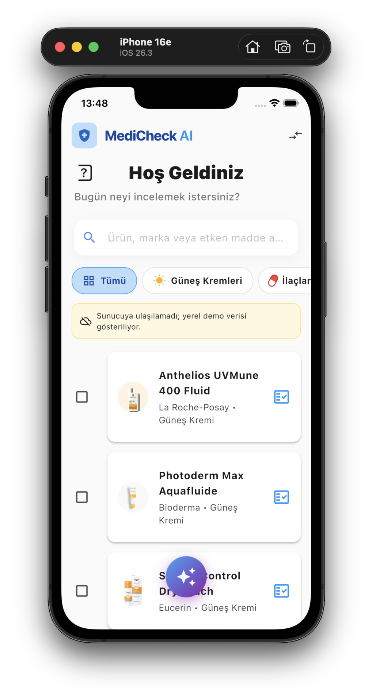 -->

<!-- 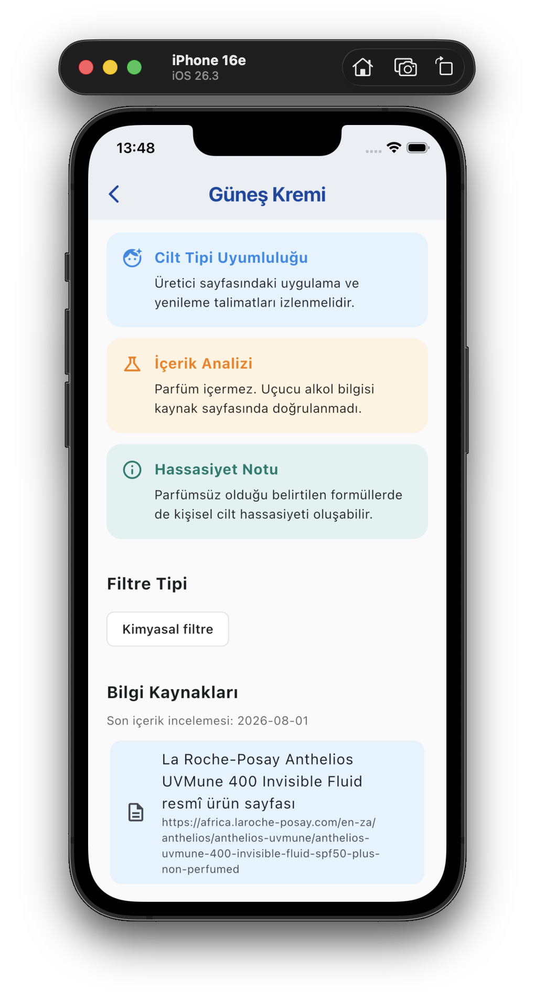 -->

<!-- 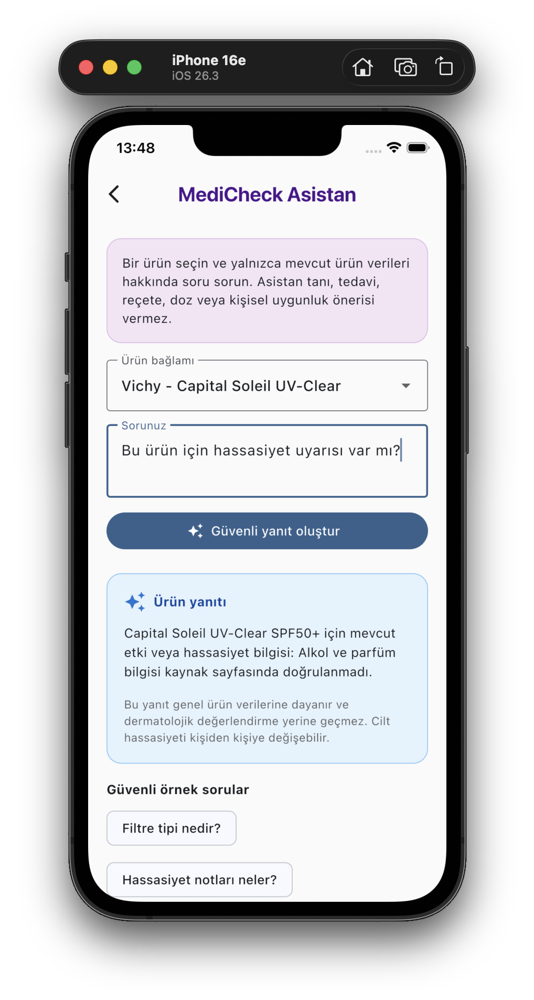 -->

<!-- 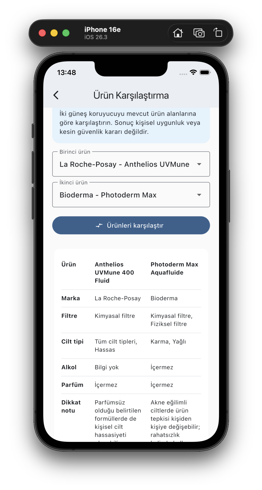 -->

<!-- 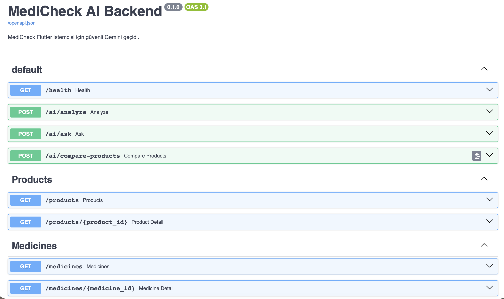 -->

---

## Kullanıcı Hikâyeleri ve Kabul Kriterleri

### Kullanıcı Hikâyesi 1: Ürün Kataloğu

**Kullanıcı olarak**, güneş kremlerini ve ilaçları liste halinde görmek istiyorum, böylece incelemek istediğim ürüne ulaşabilirim.

**Kabul Kriterleri:**

- Katalogda 10 güneş kremi ve 5 ilaç bulunmalıdır.
- Kullanıcı ürün adına göre arama yapabilmelidir.
- Kullanıcı ürünleri kategoriye göre filtreleyebilmelidir.
- Her ürün kartında ürün adı, marka ve görsel bulunmalıdır.
- Boş sonuç durumunda açıklayıcı mesaj gösterilmelidir.
- Görsel yüklenemediğinde uygulama çökmemelidir.

### Kullanıcı Hikâyesi 2: Ürün Detayı

**Kullanıcı olarak**, seçtiğim ürünün detaylarını görmek istiyorum, böylece ürün bilgilerini daha anlaşılır şekilde inceleyebilirim.

**Kabul Kriterleri:**

- Kullanıcı ürün kartından detay ekranına ulaşabilmelidir.
- Ürün adı, marka, açıklama ve kaynak bilgileri gösterilmelidir.
- Güneş kremleri için filtre ve cilt tipi bilgileri gösterilmelidir.
- İlaçlar için sadeleştirilmiş prospektüs ve uyarı bilgileri gösterilmelidir.
- Kesin sağlık ve güvenlik ifadeleri kullanılmamalıdır.
- Doktor veya eczacıya danışma uyarısı gösterilmelidir.

### Kullanıcı Hikâyesi 3: AI Asistan

**Kullanıcı olarak**, seçtiğim ürün veya ilaç hakkında AI asistana soru sormak istiyorum, böylece ürün bilgisini daha kolay anlayabilirim.

**Kabul Kriterleri:**

- Kullanıcı bir ürün veya ilaç seçebilmelidir.
- Kullanıcı seçilen ürün hakkında soru sorabilmelidir.
- AI cevabı ürün bağlamıyla hazırlanmalıdır.
- AI teşhis, tedavi, reçete veya doz önerisi vermemelidir.
- Riskli sağlık sorularında profesyonel sağlık desteğine yönlendirme yapılmalıdır.
- Loading, error ve retry durumları gösterilmelidir.
- Gemini kullanılamadığında güvenli fallback cevabı verilmelidir.

### Kullanıcı Hikâyesi 4: Ürün Karşılaştırma

**Kullanıcı olarak**, iki güneş kremini yan yana karşılaştırmak istiyorum, böylece ürünler arasındaki farkları görebilirim.

**Kabul Kriterleri:**

- Kullanıcı iki farklı güneş kremi seçebilmelidir.
- Aynı ürün iki kez seçilememelidir.
- Ürünlerin temel özellikleri yan yana gösterilmelidir.
- Karşılaştırma ekranında AI yorumu bulunmalıdır.
- AI yorumu tarafsız ve bilgilendirici olmalıdır.
- Bir ürün herkes için kesin olarak daha iyi ilan edilmemelidir.

### Kullanıcı Hikâyesi 5: Tıbbi Bilgilendirme

**Kullanıcı olarak**, uygulamanın sağlık bilgilerinin sınırlarını görmek istiyorum, böylece uygulamanın tıbbi tavsiye vermediğini anlayabilirim.

**Kabul Kriterleri:**

- Uygulama başlangıcında tıbbi bilgilendirme gösterilmelidir.
- Uygulamanın teşhis, tedavi, reçete veya doz önerisi sunmadığı belirtilmelidir.
- İlaç kararları için doktor veya eczacıya danışılması gerektiği belirtilmelidir.
- Kullanıcı bilgilendirmeyi gördükten sonra uygulamaya devam edebilmelidir.

---

## Test ve QA Notları

### Çalıştırılan Kontroller

```bash
flutter analyze --no-pub
flutter test --no-pub
flutter build web --no-pub
python3 -m unittest discover -s backend/tests -v
```

### Sonuçlar

| Kontrol | Sonuç |
|---|---|
| Flutter Analyze | Hatasız |
| Flutter Test | 34/34 Başarılı |
| Backend Test | 14/14 Başarılı |
| Flutter Web Build | Başarılı |
| WebAssembly Uyumluluk Kontrolü | Başarılı |
| Ana Sayfa | Başarılı |
| Ürün Listesi | Başarılı |
| Arama ve Filtreleme | Başarılı |
| Ürün Detay Ekranı | Başarılı |
| İlaç Detay Ekranı | Başarılı |
| AI Analiz | Başarılı |
| AI Asistan | Başarılı |
| Ürün Karşılaştırma | Başarılı |
| Görsel Fallback | Başarılı |
| Backend Endpointleri | Başarılı |
| Gemini Entegrasyonu | Başarılı |
| Gemini Fallback | Başarılı |
| Bozuk Placeholder Kontrolü | Bulunmuyor |
| Conflict Durumu | Yok |

### Test Kapsamı

- Ürün modeli JSON dönüşümü
- Veri setindeki ürün ve ilaç sayıları
- Veri kaynaklarının kontrolü
- Ürün arama ve kategori filtreleme
- Boş sonuç davranışı
- Ürün servisinin veri yükleme davranışı
- AI sonuç modeli
- Güvenli AI prompt kuralları
- Riskli sağlık sorularının filtrelenmesi
- Mock ve remote AI servisleri
- AI asistan ekranı
- Ürün karşılaştırma ekranı
- Loading, success, error ve retry durumları
- Tıbbi bilgilendirme ekranı
- Ana sayfa kullanıcı akışı
- Flutter–FastAPI bağlantısı
- Backend sağlık kontrolü
- Ürün ve ilaç endpointleri
- AI analiz, asistan ve karşılaştırma endpointleri
- Gemini yapılandırması
- Gemini hata ve fallback davranışı
- Swagger ve OpenAPI rotaları

---

## Final Demo Video Akışı

1. Uygulama açılır.
2. Tıbbi bilgilendirme ekranı gösterilir.
3. Ana sayfadaki ürünler görüntülenir.
4. Kullanıcı bir güneş kremi arar.
5. Ürün detay ekranı açılır.
6. Ürün bilgileri ve AI analiz kartı gösterilir.
7. Kullanıcı ikinci bir güneş kremi seçer.
8. Ürün karşılaştırma ekranı gösterilir.
9. AI karşılaştırma yorumu gösterilir.
10. Kullanıcı bir ilaç detayını açar.
11. AI asistana ürün veya ilaç hakkında soru sorulur.
12. Uygulamanın tıbbi tavsiye vermediği tekrar belirtilir.

### Demo Videosu

**Demo videosu:** Teslim öncesinde eklenecek.

---

## Sprint Review

Sprint 3 sonunda:

- Aktif takım yapısı üç kişi olarak güncellendi.
- Product Owner sorumlulukları Pelin Yaşar tarafından devralındı.
- Sprint 3 teknik geliştirme çalışmalarının büyük bölümü Pelin Yaşar tarafından tamamlandı.
- Demo veri seti 10 güneş kremi ve 5 ilaca genişletildi.
- Ürün ve ilaç bilgileri kaynaklandırıldı.
- Sağlık ifadeleri güvenli hale getirildi.
- AI promptları ve güvenlik filtresi tamamlandı.
- AI asistan geliştirildi.
- Ürün karşılaştırma ekranı geliştirildi.
- FastAPI backend tamamlandı.
- Ürün, ilaç ve AI endpointleri geliştirildi.
- Gemini API backend üzerinden entegre edildi.
- Flutter uygulaması backend servislerine bağlandı.
- Gemini fallback sistemi hazırlandı.
- PostgreSQL veri şeması oluşturuldu.
- Tıbbi bilgilendirme ekranı eklendi.
- Çalışmayan placeholder kontroller kaldırıldı veya pasifleştirildi.
- Yerel ürün görselleri eklendi.
- Görsel kaynakları dokümante edildi.
- Flutter ve backend testleri başarıyla tamamlandı.
- Flutter web build başarıyla oluşturuldu.

Sprint 3 sonunda MediCheck AI, final demo sırasında temel kullanıcı senaryoları gösterilebilen ve yapay zekâ kullanımını görünür hale getiren çalışır bir MVP haline getirilmiştir.

---

## Sprint Retrospective

### İyi Gidenler

- Ekip yapısındaki değişikliğe rağmen Sprint 3 kapsamı yeniden planlandı.
- Product Owner ve Scrum Master sorumlulukları kesintisiz yürütüldü.
- Proje gerçek FastAPI ve Gemini entegrasyonuna taşındı.
- Veri seti 10 güneş kremi ve 5 ilaca genişletildi.
- AI asistan ve ürün karşılaştırma akışları tamamlandı.
- Sağlık güvenlik kuralları geliştirildi.
- API anahtarı mobil uygulamaya gömülmeden güvenli şekilde yönetildi.
- Gemini kullanılamadığında uygulamanın çalışmaya devam etmesi sağlandı.
- Yerel ürün görselleri uygulamaya eklendi.
- Flutter ve backend testleri başarıyla tamamlandı.
- Final web build başarıyla oluşturuldu.

### Zorlanılan Noktalar

- Irmak Gündüz’ün ekipten ayrılması görev dağılımının yeniden yapılmasını gerektirdi.
- Pelin Yaşar’ın Scrum Master, Acting Product Owner ve Lead Developer görevlerini birlikte yürütmesi iş yükünü artırdı.
- Sprint 3 teknik geliştirmelerinin büyük bölümü Pelin Yaşar tarafından tamamlandı.
- Takım üyelerinin hazırladığı ilk çalışmaların final mimariye dönüştürülmesi ek entegrasyon gerektirdi.
- Flutter, FastAPI ve Gemini katmanlarının birlikte geliştirilmesi teknik koordinasyon gerektirdi.
- Canlı PostgreSQL bağlantısı final sprint süresi içinde tamamlanamadı.
- Sprint Board ve final görselleri teknik geliştirmeden sonraya kaldı.

## Sprint 3 Sonucu

Sprint 3 sonunda MediCheck AI; 10 güneş kremi ve 5 ilaç içeren kaynaklı veri setine, yerel ürün görsellerine, ürün detay ekranlarına, ürün karşılaştırma özelliğine, güvenli AI soru-cevap asistanına, FastAPI backend’e ve Gemini API entegrasyonuna sahip çalışır bir final MVP haline getirilmiştir.

Sprint 3 teknik geliştirme çalışmalarının büyük bölümü Pelin Yaşar tarafından gerçekleştirilmiştir. Seymen Budak, Flutter karşılaştırma ve AI sohbet arayüzünün ilk prototipine katkı sağlamıştır. Yusuf Emre Sucu ise taslak ürün, ilaç ve backend dosyalarıyla veri ve backend başlangıç desteği sağlamıştır.

Flutter uygulaması ve FastAPI backend testlerle doğrulanmış, web build başarıyla oluşturulmuş ve Gemini servisinin kullanılamadığı durumlarda sistemin güvenli fallback cevaplarıyla çalışmaya devam etmesi sağlanmıştır.

Canlı PostgreSQL bağlantısı, kullanıcı hesapları, favoriler, QR, profil ve barkod/OCR özellikleri final MVP kapsamı dışında bırakılmıştır.

Final teslim için Sprint Board görseli, uygulama ekran görüntüleri, Swagger ekran görüntüsü ve en fazla 3 dakikalık demo videosu README’ye eklenecektir.


